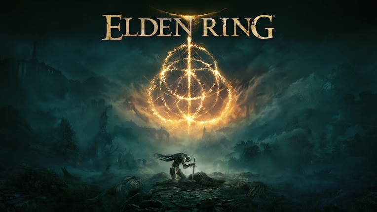
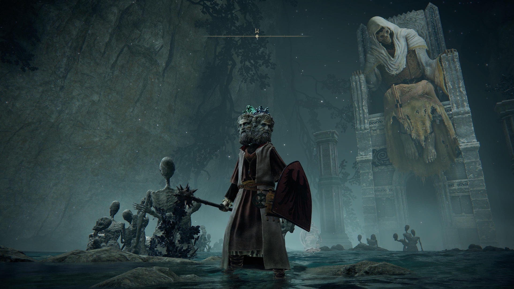
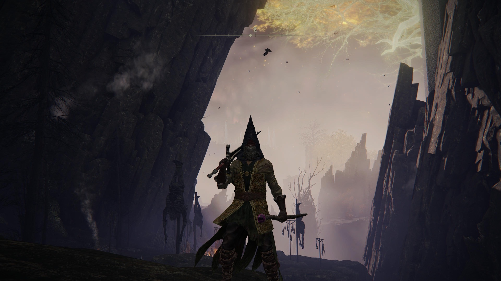
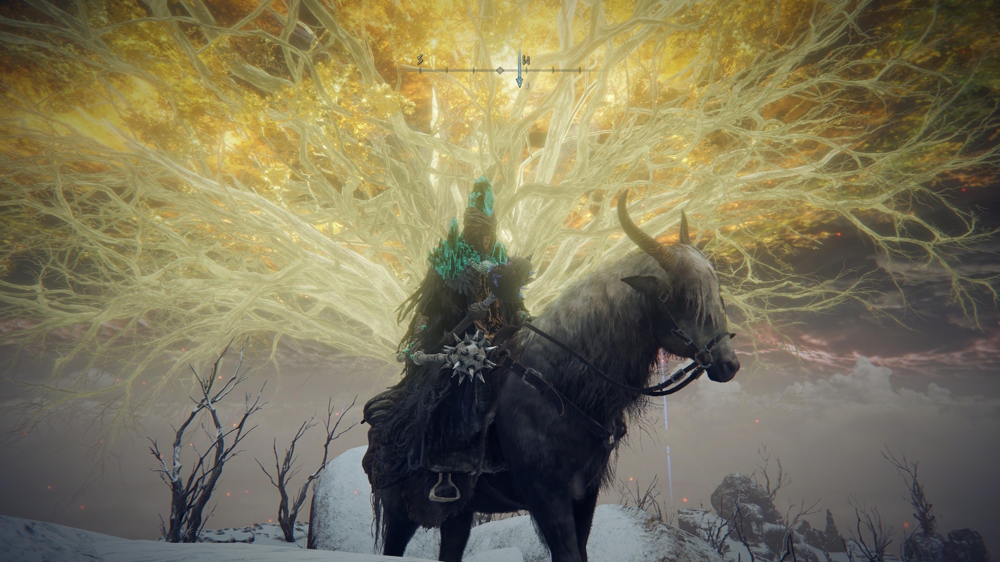
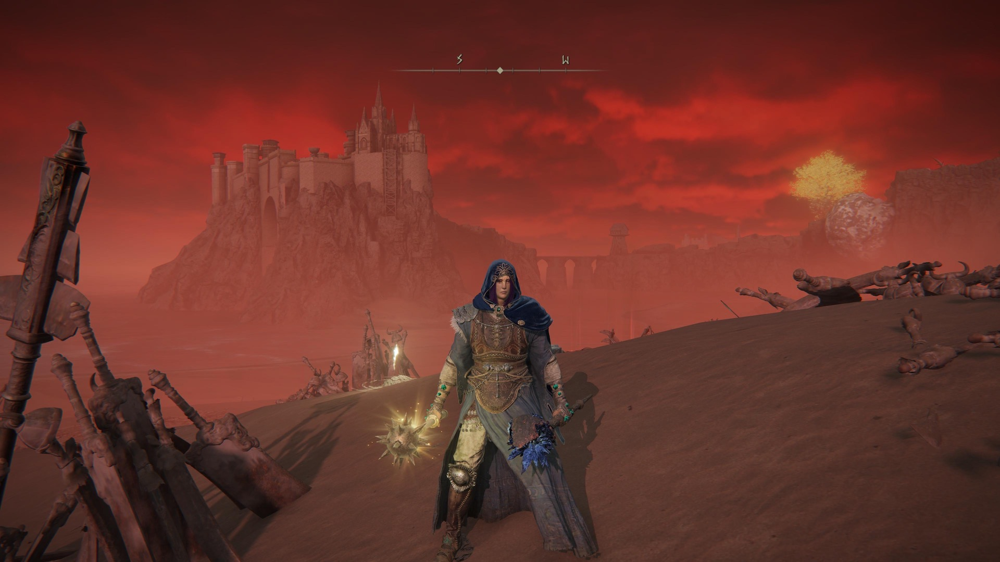

+++
title = "Elden Ring"
date = "2022-03-09T02:39:37.442Z"
description = "\"Umm actually they're called runes not souls\""
gaming = 2022
system = "PS5"
completed = false
platinum = false
+++

## Notes

My initial reaction to this game, from previews to launch, was "ah, another FromSoft game in the vein of Dark Souls? *Pass.*" The hype around this game was just too much, though, that I couldn't ignore it anymore. After seeing it take over gaming Twitter, YouTube, and Twitch, and it blowing up my RSS feeds, reports of a vastly more accessible entry in the Soulsborne genre got my curious.

After some hemming and hawing I decided to set down [Horizon Forbidden West]() and give Elden Ring a try. Boy, have this game gripped me in a way I'd never have predicted.

Suffice to say it's been nearly 100 hours now and, three months later, it's literally the only game I've been playing. There's just way too much content! Catacombs, "legacy dungeons", puzzles, a world map that just keeps growing and growing and growing...for the longest time just when I'd thought I'd seen it all I finally find the next map piece and realize, damn, I still don't know what's over on that remaining big greyed out chunk.

I won't turn this into a typical review of the game; those are easy enough to find. Instead here's a bit about my specific journey:

- I wanted to experience the story, so I rolled an INT character, a.k.a. a mage. Being able to shoot at things from far away worked well to keep me out of harms way in the first couple dozen hours, and allowed me to explore the world to my heart's content. I initially alternated between magic and melee, with a shield in my offhand as a constant companion. Around hour 80 I experimented with and then grew comfortable enough (and powerful enough) to keep my staff in my left hand and a mace + Moonblade in my right. At just over 60 INT and 23 DEX I pack enough of a punch to continue plumbing the depths of the game. At the time of this writing I've discovered all of the map and am currently trying to figure out how to make it to the Hellig Tree. I've also got the Ashen Capital to explore now...

- Advice I saw in the early days of the game to keep a journal was totally correct. There are so many side quests and characters you come across with *large* swathes of time in between quest segments that my notes became an indispensable part of my experience. One of my favorite notes:

> - Witchbane Ruins, found a nameless chick spiked to the wall sobbing
>    - It was the real Sellen lol

- Twin Skeleton Soldiers will get you through a surprising amount of the game. Even as one of the "basic tier" spirit ashes they were still indispensable in pulling aggro for squishy ol' me. They also lasted longer in battle than expected thanks to their ability to reanimate after death, provided nothing melee'd them in their downed state. A+++ would equip again.

- Mimic Tear, even nerfed, is still realllly good in late game. I beat Maliketh in my first try because I had a duplicate of my self pulling aggro and firing off Comet Azures while I abused my Flask of Wondrous Physick to do the same. The spirit ashes in general are a really fun system, even if there are some definitely "strongest" ones in the meta.

- The ability to fast travel at any time is welcome. I think in previous games you had to find a bonfire/lantern to do so, but in ER you can just pop open the map and go. I appreciated how quickly the game loaded, too, especially as I zipped around trying to find the NPC that would trigger the next part of a quest.

- I first treated armor in this game as something that must always be upgraded. As I gradually came to accept, stats on weapons and armor are secondary to getting mechanically good at the game. This opened the door for me to get more creative and play dress-up with some pieces I'd previously poo-poo'd. A+++ would play dress-up much earlier next time

- It's okay to watch build guides, and videos showing off quest lines, and even a few "things you missed videos". Early on, after deciding I liked the game enough to continue, I watched a guide on YouTube by IronPineapple titled ["Elden Ring — How to Break the Game With Magic"](https://www.youtube.com/watch?v=xCu8PBoj-Ks) that helped establish a clearer strategy for skill progression that would help me focus on a feasible build instead of being mediocre at everything. And the game has so much content in it that even I, with my slow and methodical "explore every nook and cranny, surely this is everything here", have been surprised from time to time by Domtastic Gaming's ["Everything you missed in..."](https://www.youtube.com/watch?v=HTzI-k3qZTs) series of videos that reveals some thing in some weird corner that I'd obliviously run past several times. Normally I'd wait till I beat a game to watch such videos, but as an RPG Elden Ring really does require multiple playthroughs to see everything.

So like I mentioned earlier I still have a ways to go; I'm maybe 75% of the way done with the main storyline anyway. I also have my eye on a couple major side quests that I want to advance as well. And after all *that* I might actually respec and then try a bit of PVP - if I can find the right build it looks like a fun time.

**Elden Ring: A++++ probably won't replay because it's a *lot* of game but my god have I enjoyed every second of it.**
