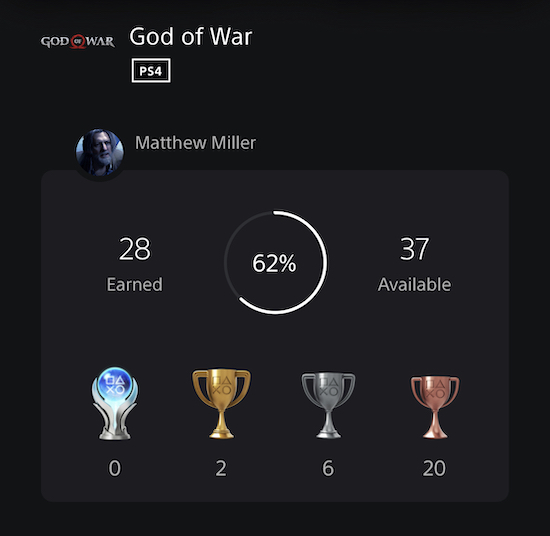

+++
title = "God of War (2018)"
date = "2022-07-29T00:45:42.957Z"
description = "BOY!"
gaming = 2022
system = "PS5"
completed = true
platinum = false
[[resources]]
src = "images/boxart.jpg"
name = "featured"
+++

I'd missed playing all the other God of War games growing up for lack of a PlayStation console. This time, though, I'd heard enough good things about the 2018 reboot of God of War, and the price was right, (*free*, for being an item in the [PlayStation Plus Collection](https://www.playstation.com/en-us/ps-plus/games/#ps-plus-collection)) so I decided to give it a shot.

Boy, was I pleasantly surprised!

The combat was just challenging enough, the map responded beautifully to story events, I traveled to aesthetically diverse regions with just enough exploration, characters had their backstories explored, there was _actual character development_ between Kratos and Atreus as the game progressed...this game was a fun, fun time from start to finish.

The one part of the game I disliked were those dang Valkyrie fights at the end. When combat difficulty had ratcheted up to 7 by the time credits rolled, these optional encounters jumped things straight up to 10 without offering additional boons to make it feel like a fair fight. I could only get through a couple before the trial-and-error of subsequent encounters stopped feeling like fun.

Lastly, the one thing I regret was waiting so long to play. [At least now I won't have to wait long till the sequel](https://store.playstation.com/en-us/product/UP9000-CUSA34384_00-GOWRAGNAROK00000)!

**Final trophy count: 28 of 37**

