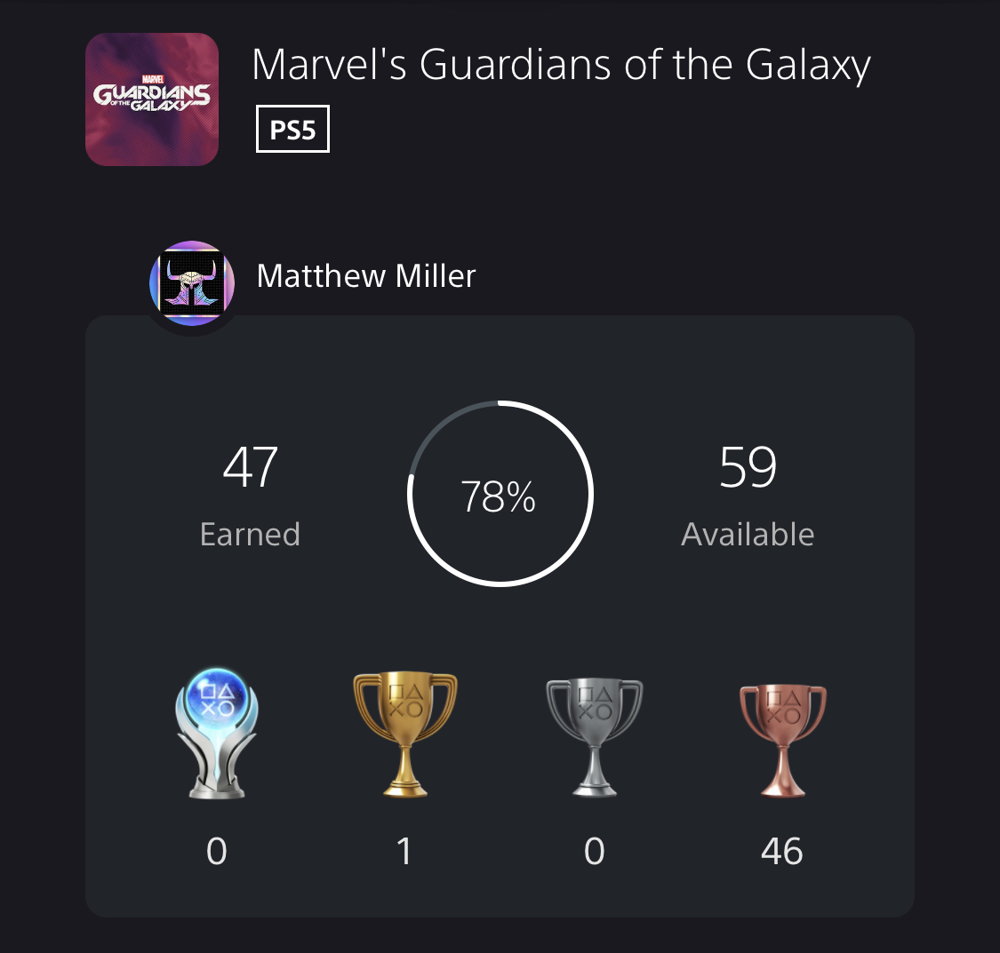

+++
title = "Guardians of the Galaxy"
date = 2022-01-01T23:06:16.659Z
description = "RODENTS. IN. SPAAAAACE."
gaming = 2022
system = "PS5"
completed = true

[[resources]]
src = "images/boxart.jpg"
name = "featured"
+++

I enjoyed the heck out of this game! The writing in particular was fantastic. Believable character development, Telltale-light consequences of my actions bearing fruit later, and a great sense of travel across the galaxy all came together to create a unique game that I encourage you to try. The level of detail in all of the maps was surprisingly high and made for gorgeous vistas. And in addition to collectibles and character skins giving me plenty of reasons to go off the beaten path, I was often surprised to hear barks from team members chastising me for "getting lost". These lines made the characters feel more alive and helped get me a bit more invested in the fate of the team.

Combat was the relatively weakest aspect of the game, but there wasn't anything about it that got in the way of my overall enjoyment of the experience. I'd give the game a solid 8 out of 10.

I chose not to pursue the Platinum trophy for this one because of trophies like [Thoughtful Captain](https://www.playstationtrophies.org/game/marvels-guardians-of-the-galaxy/trophy/402507-thoughtful-captain.html) that seemed like a real slog to collect:

> Please note that if you miss any collectible while playing through the story, using Chapter Select will not count towards the collectible trophies. It's the most bizarre working of a game with this many but the only way they'll save is if you play the rest of the game from whatever chapter you started on. If you missed a collectible in Chapter 4 and use chapter select to get it, you'll need to play the rest of the game from Chapter 4 and on and recollect anything you have already picked up along the way. It's bonkers but that's why this is marked as missable.

I also read that the "Call to Action" trophies like [No Way, Nova Corps](https://www.playstationtrophies.org/game/marvels-guardians-of-the-galaxy/trophy/402490-no-way-nova-corps.html) rely on a degree of randomness *during combat* to collect:

> As you're going through the fights in the game, you'll periodically come up against enemies that you can use a "Call to Action" ability on. A (triangle button) will appear above the enemy and when you press it, a random Guardian will do a special attack. The problem is that you can't exactly choose which Guardian does it so you may need to make a few attempts at these trophies.

I've got too many things waiting in the wings to make me want to complete that busy work.

All told 78% is still a respectable completion rate after a single playthrough:

