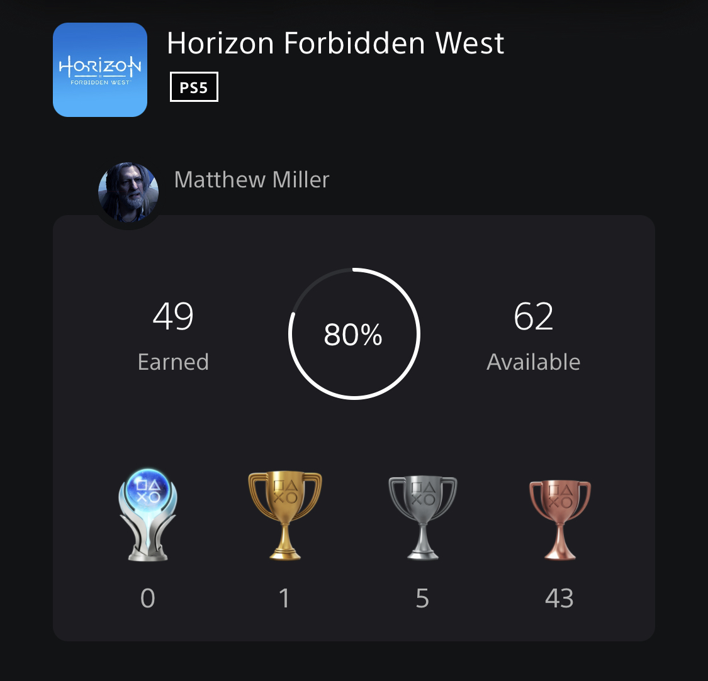

+++
title = "Horizon Forbidden West"
date = "2022-09-30T02:18:48.995Z"
description = "That's almost too much detail on that skin texture, Guerrilla Games..."
gaming = 2022
system = "PS5"
completed = true

[[resources]]
src = "images/boxart.jpg"
name = "featured"
+++

I originally started this game back just before [Elden Ring]() came out. When I caved to Elden Ring internet peer pressure I dropped it entirely.

I came back afterwards…but almost begrudgingly?

It's been an odd case of wanting to experience the story, but not feeling all that enthusiastic to engage with the gameplay in between. Don't get me wrong, HFW is refined Horizon Zero Dawn, and expands on it with new systems paired with a much larger, more detailed world, but it was almost too much content to contemplate playing in any reasonable time frame. I often hesitated to start up the game, but once I did it was no problem remembering how to juggle the weapon wheel, aim for parts to break off, scan the puzzles, and run from settlement to settlement pulling quests and occasionally upgrading. Competently formulaic.

HFW's compelling story is what pulled me forward even when the gameplay did not. I appreciated the return of characters from HFW, and the new friends who joined up showed depth at the outset while developing their characters throughout the rest of the game. I appreciate the developers taking the time to build out everyone's backstory, not just Aloy's. And some unexpected twists exploring more of the sci-fi aspects of the universe led to a very unpredictable second half.

I hit credits at just under 50 hours of gameplay. Many of those hours were spent on side quests, which accidentally over-leveled me to max level well before the main storyline missions suggested I be at least level 35 to proceed. The ease at which I breezed through some of the later missions definitely revealed the lack of scaling; overleveling sanded down the edges on many late-game encounters, up through the finale past the Point of No Return. I was actually fine with this, though, because it meant I could get to the plot more quickly.

I guess I'm glad I played this game…having seen it end with a clear setup for a third game, though, I'm left with the feeling that maybe I'll eventually watch a Let's Play of it, if it ever comes out anyway.

**Final trophy count: 49 of 62**

## Notes - June 2022

> Note: These were notes I'd originally jotted down after my initial time with the game, before Elden Ring pulled me away from it. I wouldn't get back to this game till early September.

For better or for worse this is more of Horizon Zero Dawn...but with a few new gameplay mechanics and a *way* crazier storyline than the first allowed. Overall the mechanics seem very similar to the first game: buy gadgets, hunt beasts for items to upgrade, and occasionally pick up some new duds. I don't remember a leveling up system for the armor, so that seems new, though it may just be it's been that long since I last played HZD.

I admit I've only just come across the first real plot twist, and it caught me by surprise so now I have no idea anymore where they game is going to take things. It was surprising enough to make me want to go back and see what happens, even if I'm not particularly enthused to go back to the "stealth is the way" gameplay that makes every encounter right now a bit slow to get past. I assume that as I get back into the swing of things, and accumulate better armor and weapons, I'll figure out a more dynamic game play style, but for now it's still very much:

1. Sneak up and find cover
2. Scan
3. Start sniping off the important bits

That said the feedback the game gives when you hit that robo-elk's acid canisters is just :chefkiss:

As of June 2022 this game sits second-from-the-top of my backlog (below the newly-purchased Ratchet and Clank A Rift Apart. $40! *Can you believe it?*) Going back to HFW will probably be the nice, action-y cooldown I need after the 3+ month-long [Elden Ring]() bender I've been on, though - I'm not yet ready to throw in the towel on this one...
