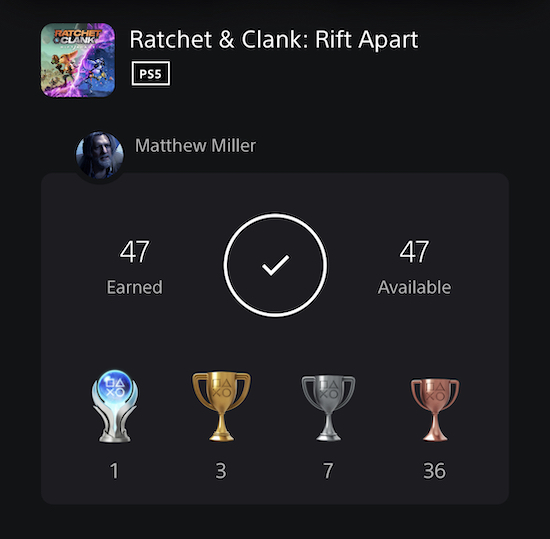

+++
title = "Ratchet & Clank: Rift Apart"
date = "2022-11-03T04:56:35.853Z"
description = "More than a tech demo..."
gaming = 2022
system = "PS5"
completed = true
platinum = true
[[resources]]
src = "images/boxart.jpg"
name = "featured"
+++

I think I remember this game being touted as a true demonstration of the next-gen capabilities of the PS5. Something about the transition between maps via the game's "rifts" being seamless because the game could stream data at insanely high rates.

Practically speaking, the well-executed traveling between dimensions made this game very hard to ever put down. I think that's been a constant in my time with the Ratchet & Clank series, including the remaster of the first game I played thanks to it being in the [PlayStation Plus Collection](https://www.playstation.com/en-us/ps-plus/games/#ps-plus-collection): once I started playing, the game was just so much fun that I had to force myself several times to stop for the night. Combat was a throwback to mid-2000's gaming, but refined for today's expectations. Movement around some impressively large and colorfully detailed maps was augmented by new, unexpected items. And this all glued together a really sweet story of two Lombaxes just trying to figure things out after their dimensions collide. Not to mention the game never felt like it dragged one; that is to say I felt like the adventure was perfectly paced from start to finish allowing me to wrap things up in a couple dozen hours.

This game was the perfect palette cleanser after dedicating so much time to playing the absolutely *massive* games [Elden Ring]() and [Horizon Forbidden West](). In fact I enjoyed the game so much that I decided to go for the Platinum trophy (it helped that the game's trophies all had reasonable conditions)! 🎉

**Final trophy count: 47 of 47**

