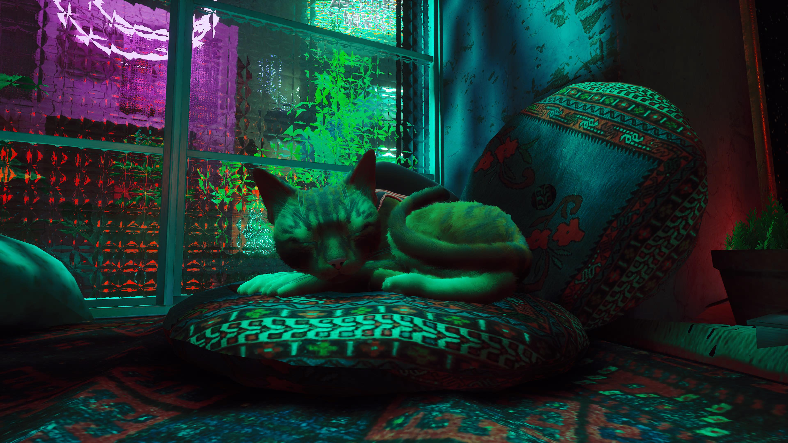
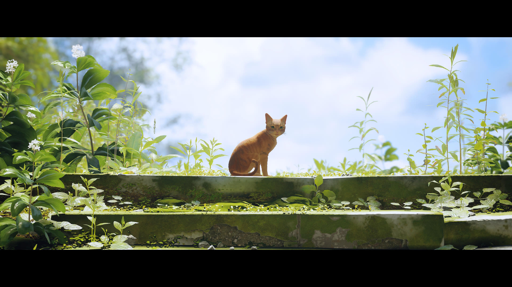
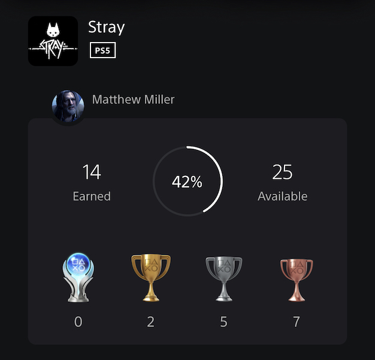

+++
title = "Stray"
date = "2022-11-26T02:08:47.845Z"
description = ""
gaming = 2022
system = "PS5"
completed = true
platinum = false
[[resources]]
src = "images/boxart.jpg"
name = "featured"
+++

Stray is a "cat adventure game" that I'd followed development of for [*over seven years!*](https://hk-devblog.com/2015/10/07/first-step/) It very quickly won me over both for the setting (based off of Kowloon Walled City) and for [the effort they put into animating the cat](https://hk-devblog.com/2016/01/10/some-gameplay-work-in-progress/). It looked like it would be a very charming game:

The game released in July 2022, but I waited to play because the reviews claimed it was only 6-8 hours long. Six to eight hours? For $30? The gumption of these indie devs!

(Nevermind the fact that paying $30 for an entire day of fun is almost unheard of anywhere else...)

I finally got my hands on Stray in December when a Black Friday deal let me upgrade the remaining 900+ days of PS+ to the Extra tier for a flat $80(!!). Stray came as a free game in Sony's version of Game Pass, and so it was the first thing I downloaded.

Indeed, the game was short - the console clocks my completion time at just five hours. If I'd gone trophy hunting I might have been able to squeak in another hour or two.

But enough about game duration! Stray game is gorgeous! And the cat controls really well! And there's a dedicated meow button! As far as games go in which you play a cat, Stray delightfully combines a compelling story, gorgeous art direction, and surprisingly fluid gameplay with enough proper cat mechanics to at least make for a memorable experience.

**Final trophy count: 14 of 25**

