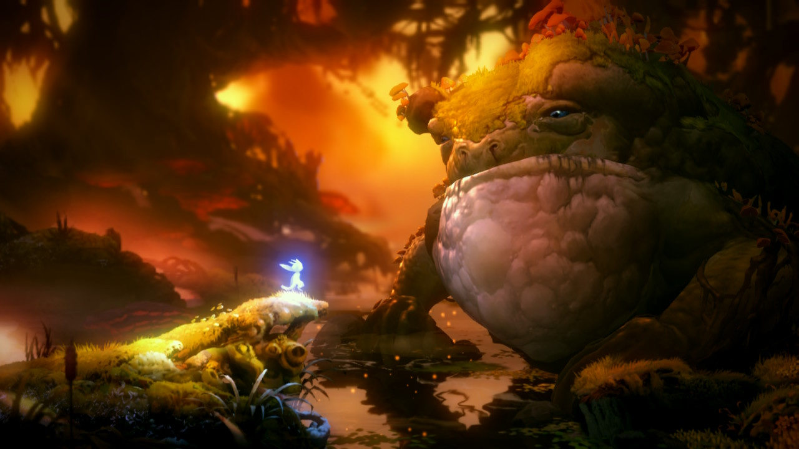
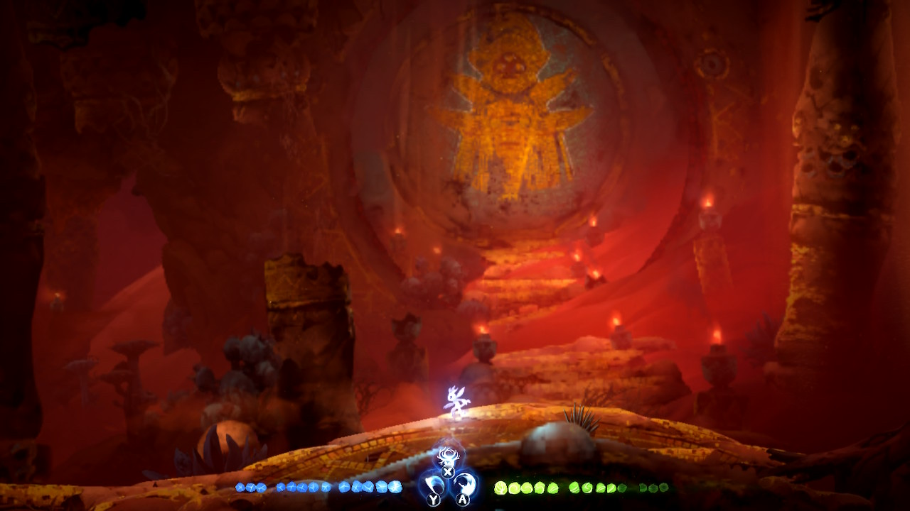
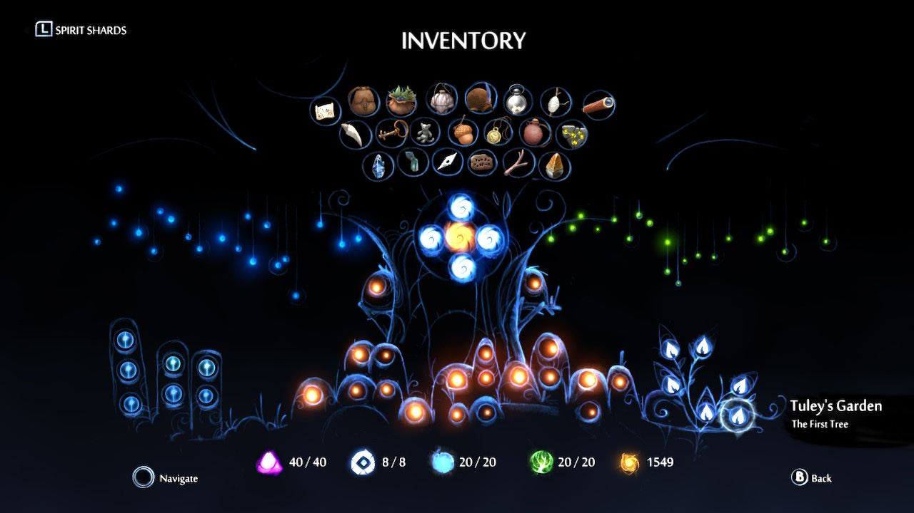

+++
title = "Ori and the Will of the Wisps"
date = "2023-12-31T00:00:00.686Z"
description = "A wonderful follow-up to a whimsical metroidvania"
gaming = 2023
system = "Switch"
completed = true

[[resources]]
src = "images/boxart.jpg"
name = "featured"
+++

I played the original [Ori and the Blind Forest](https://www.nintendo.com/us/store/products/ori-and-the-blind-forest-definitive-edition-switch/) a couple of years ago and appreciated its metroidvania for having tight movement and combat controls, and not trying to be too clever. It was also a bit on the shorter side, a dozen hours or so, but in a good way.

I was happy to see that its sequel is "more of the same". Ori and the Will of the Wisps had gorgeous graphics, was very responsive during combat and exploration (and never felt too hard whenever bosses appeared), offered a well-balanced drip of capabilities, and rewarded me for exploring off the beaten path.

If there was something about this game I didn't like I'd have to say it was the time trials. That kind of challenge has never really appealed to me, so while I'll give them run a shot or two when they show up in a game, in the case of Ori I did this for two of the six or so challenges and didn't even bother with the rest.

What was unique about these challenges was the "ghost you" raced against. I suppose it's better to visualize the "ideal" run of a course than to simply being shown a timer, especially since the races didn't put up barriers to keep you from going off the path. Points for this improvement, but it still wasn't enough for me to bother trying to complete all of these challenges.

Anyway I spent a *very* satisfying 13 hours and 37 minutes from start to finish. I'd highly recommend [Ori and the Will of the Wisps](https://www.nintendo.com/us/store/products/ori-and-the-will-of-the-wisps-switch/) to anyone who's a fan of metroidvanias.

