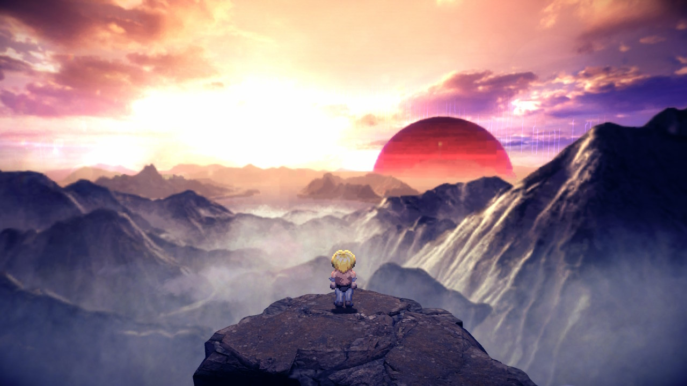
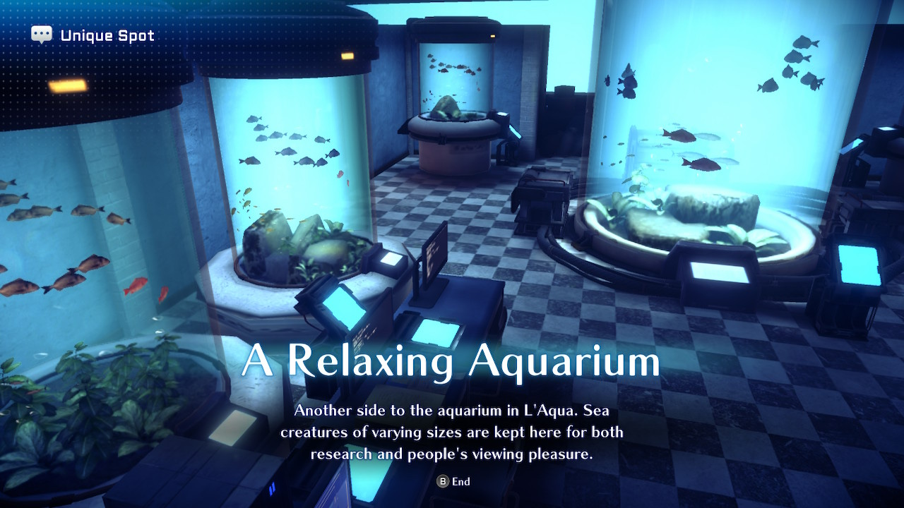
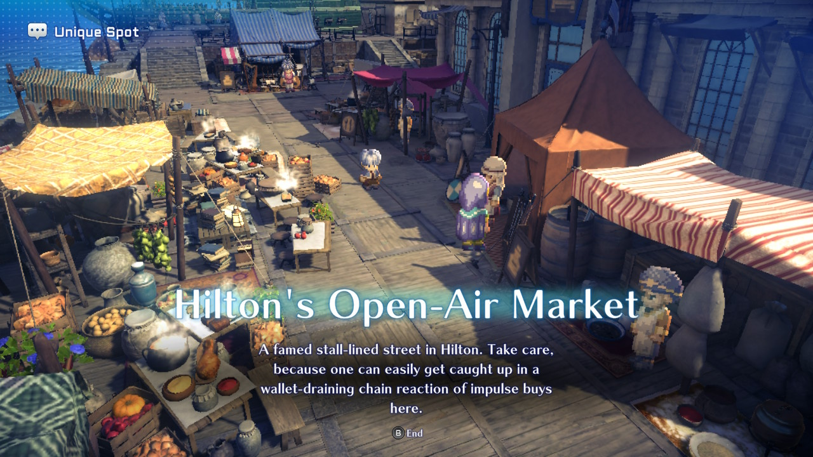
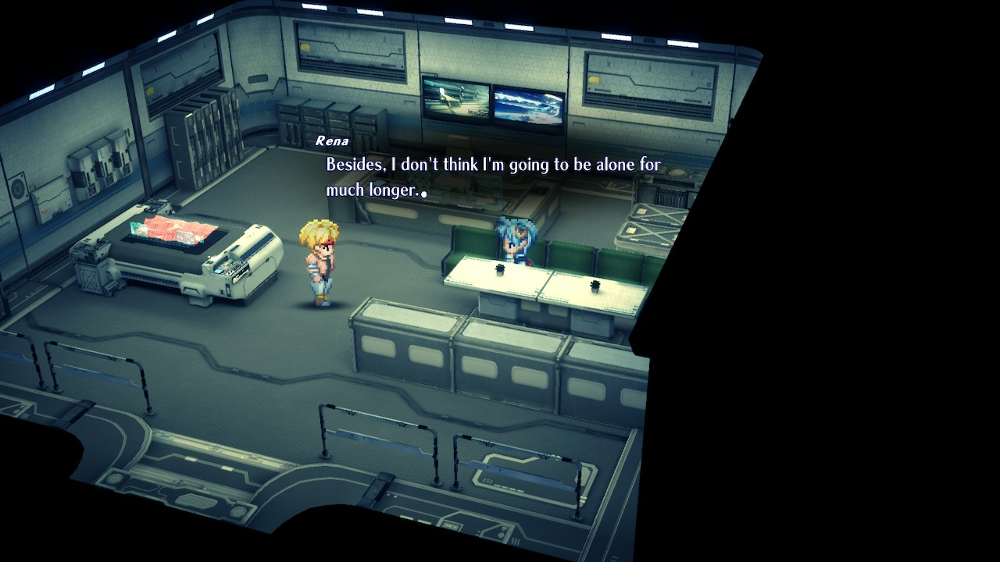
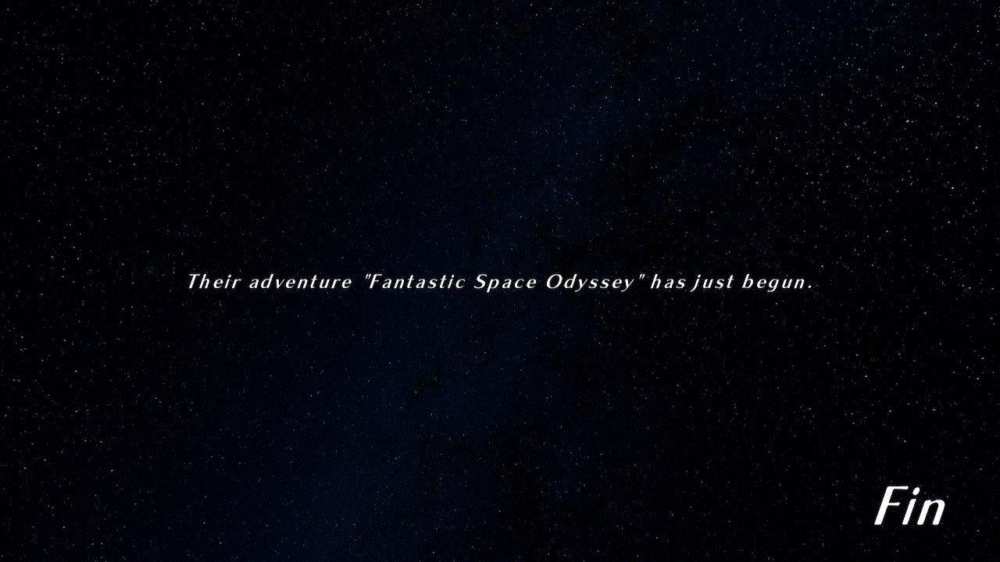

+++
title = "Star Ocean: The Second Story R"
date = "2023-12-26T21:28:43.379Z"
description = ""
gaming = 2023
system = "Switch"
completed = true

[[resources]]
src = "images/boxart.jpg"
name = "featured"
+++

This game series flew completely under my radar all these years. It wasn't until a recent trip abroad that my fellow Switch friends recommended me this game and boy, I'm glad I listened.

The game surprised me the most with how *everything* was voice-acted. I did a double-take in the first few minutes when I realized that [Spike Spencer](https://www.imdb.com/title/tt28227697/characters/nm0818111) (the gentleman who dubbed Shinji's voice in Evangelion) voiced the male protagonist Claude C. Kenny (and fortunately the character was written with more of a backbone and so he never came off as too whiny!) A couple of other famous voice actors from anime and video game dubs of my youth made appearances too, including [Richard Epcar](https://www.imdb.com/name/nm0258268/) (who voiced the lovable Batou in the Ghost in the Shell dubs) and [Eden Riegel](https://www.imdb.com/name/nm0726180/) (who I recognized from her dub of Popola in both Nier games.)

The other thing that pleasantly surprised me was the game's graphical aesthetics. In a style I'm claiming was inspired by Octopath Traveler (because it was my first main exposure to it), TSSR was a "2.5D" game where 2D sprites wander around a 3D-modeled world. Characters were drawn in eight different directions, though, and it was convincing enough that moving the camera round the overworld "rotated" the characters accordingly. Visual effects during combat were 3D models too but with everything going on, especially as higher-level spells were learned, it all came together in a really satisfying way.

I also appreciated the Unique Spots you could find here and there. The camera would move in closer on some part of the map, and you'd get a bit of little flavor text of the area. More importantly you'd also get an opportunity to appreciate more of the detail that went into the models:

As far as game mechanics go fast travel was highly appreciated, as was the choice to show enemies on the maps instead of using random encounters. Some of the game systems were a little inscrutable at first, though, like the various Specialties, and armor and weapon crafting and enhancements took some time to level up make sense of. Guidance from a Star Ocean fan helped me build a game-breaking weapon sooner than I'd have figured it out on my own, which helped me stay focused on the story (and highlighted how the game allows you to break it if you're willing to invest in getting deep into its systems.)

Honestly the one gripe I had at the end was that it ended before I knew it. My playtime clock ended at about 27 hours, though, which is nothing to sneeze at! In retrospect this was probably just the right amount of time - 2023 seemed to be more about shorter games that 2021 or 2022, and this game definitely represents a game that doesn't overstay its welcome.

**Final score: 9/10 would recommend to JRPG fans.**
