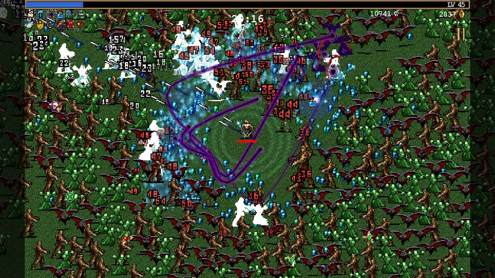

+++
title = "Vampire Survivors"
date = "2023-08-27T18:30:16.447Z"
description = ""
gaming = 2023
system = "Switch"
completed = false

[[resources]]
src = "images/boxart.jpg"
name = "featured"
+++

What the hell is this game? I mean just look at this chaos lmao

I guess you could call it a rogue-like. Each map starts out with just a few enemies here and there, but as the minutes tick by there are ever-increasing numbers of enemies who swarm you while you bob and weave to avoid them.

Weapon synergies make or break a run, but fortunately as you learn the synergies you unlock the ability to view those combinations for later runs to strategize which power-ups to focus on as you level up. There are lots of levels, characters, and power-ups to unlock and level up, but each round is so loooooong. At first they're 30 real-time minutes, however you eventually unlock a round modifier that can get that down to 15 minutes per run. Even then this was still a long time to pick up and start if I wasn't sure I could remain locked in for that long.

Those caveats aside, I thought it was a fun enough romp for the 10 hours or so I put into it.
