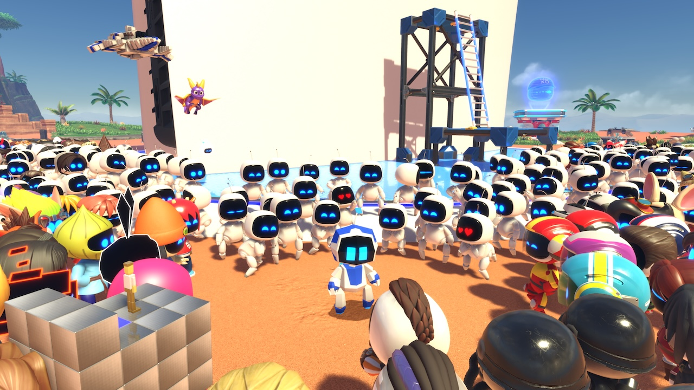
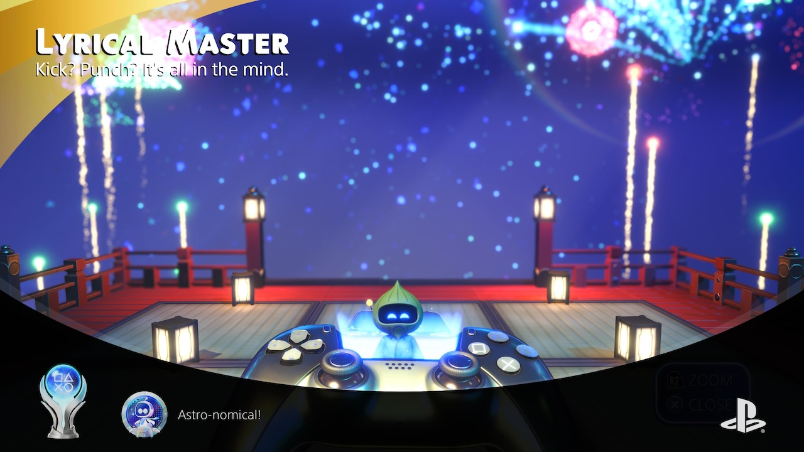
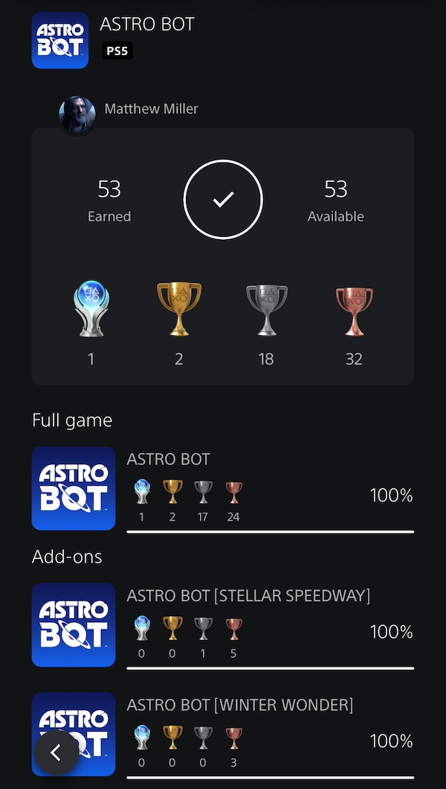

+++
title = "Astro Bot"
date = "2024-12-30T02:25:33.819Z"
description = ""
gaming = 2024
system = "PS5"
completed = true

[[resources]]
src = "images/boxart.jpg"
name = "featured"
+++

Astro Bot, just like Astro's Playroom before it, wraps very responsive platform controls around an absolutely adorable visual aesthetic. But unlike Playroom, Astro Bot is a lot more game and turns the creativity up to 11. Every world is colorfully, uniquely themed, and there are a surprising number of callbacks to PlayStation IP (vis-a-vis bots you rescue on each level themed as different characters) from the PS1 on up. Jumping Flash? Wild Arms? It's all here, and somehow all made adorable.

All in all I spent just under 20 hours to platinum the game and all of its free DLC, and loved every minute of it...except for the final Great Master Challenge level unlocked after collecting all 300 bots and every puzzle piece! It was a rare skill check of a level after an otherwise forgiving game, but I ultimately prevailed to score the Platinum trophy.

I ended up 100%'ing all the DLC too. Of everything I played this year I'd probably say this is my #1 favorite game of 2024.

**Final trophy count: 53 of 53**

