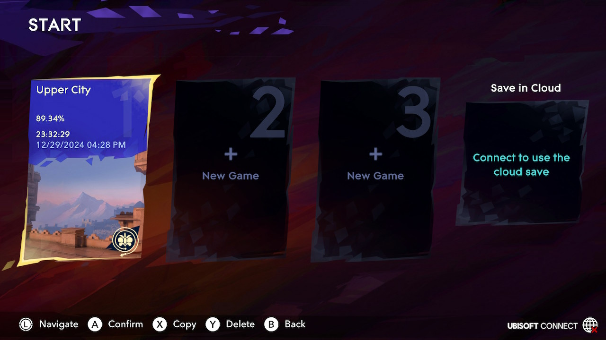

+++
title = "Prince of Persia: The Lost Crown"
date = "2024-12-30T02:26:12.462Z"
description = ""
gaming = 2024
system = "Switch"
completed = true

[[resources]]
src = "images/boxart.jpg"
name = "featured"
+++

With the game calling itself "Prince of Persia" I initially thought it would somehow tie in to [The Sands of Time trilogy](https://en.wikipedia.org/wiki/Prince_of_Persia#Trilogy_collection) from way back on the GameCube; I couldn't quite make sense of this when I also heard that The Lost Crown was a [metroidvania](https://en.wikipedia.org/wiki/Metroidvania). This uncertainty had me put off playing the game for everything else on my gaming backlog, despite all of the really positive news around it at launch. Earlier trepidation aside, I'm really happy I managed to fit in a playthrough before the end of the year.

After beating the game I'm pleased to say that the game stands on its own for its intriguing story, talented application of metroidvania game mechanics, and respectful tests of player skill. I especially appreciated the fact that on Normal difficulty I could learn bosses' patterns in 2-3 tries to beat them and keep the plot moving.

As with many of these kinds games I sometimes felt it took its time unlocking more movement mechanics to get past the obvious places to use them. As a map completionist, though, the "long delays" could very well have been my own fault for how often I'd find the edges of traversable space with my current moveset. I'm also bad at taking the time to search every nook and cranny for collectibles, which stretched out the time between major plot points that unlocked more abilities.

Once I unlocked a new abilities, though, all was forgiven. One thing I really appreciated was how granular fast travel became later in the game. At first, I was limited to teleport "stations" I could find scattered around the map, maybe a dozen in all. Later on, though, I gained the ability to fast travel to **any Wak Wak tree** (the game's rest areas) I'd reached. This significantly sped up late-game item collection and was a clear indication that the game wanted to respect my time.

The story was a fun one, too, and actually made some sense out of the "stuck in time" trope that wrapped around the entire plot.

Just under 24 hours later I'm quite pleased with this game; it's probably my #2 favorite of 2024 (after [Astro Bot]()!)

