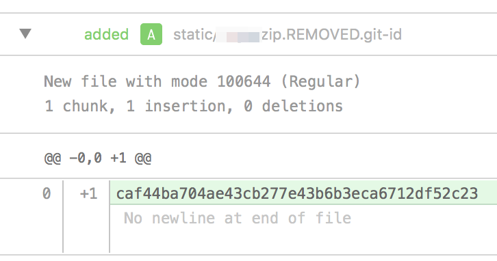

+++
title = "How to mirror a git repo with large files in its commit history, part 2"
description = "Using BFG Repo Cleaner to prune large files from a repo's commit history"
date = "2018-08-28T17:47:32Z"
categories = ["git", "howto"]
keywords = ["github", "git", "bfg repo cleaner"]
draft = true
hasCode = true
+++
In an earlier post I used `git` to prune a couple of files larger than Github's filesize limite of 100MB from a repo's commit history.

While tackling that issue, I discovered a program called [BFG Repo Cleaner](https://rtyley.github.io/bfg-repo-cleaner/) that streamlined the whole process and offered some more flexibility in handling subsequent issues.

BFG is a JAR file you can invoke via the command line that will, among other things, replace large files with empty placeholders.

To install BFG on macOS High Sierra, I installed Java using Homebrew:
```sh
$> brew cask install java
```
Once Java finished installing, I [downloaded the latest version](http://repo1.maven.org/maven2/com/madgag/bfg/) (**v1.13.0** as of writing this) and dropped it in the root folder of the problematic repo (at the same level as the **.git/** directory.)
Running BFG was pretty simple. I used the flag that told it to prune any file larger than 100M:
```sh
$> java -jar bfg-1.13.0.jar --strip-blobs-bigger-than 100M .git
```
In seconds, BFG crawled through all commits leading up to HEAD and replaced any blob larger than 100M with a tiny plaintext file containing the git hash of the file itself:

Afterwards, BFG will ask you to run `git reflog expire --expire=now --all && git gc --prune=now --aggressive`. **DON'T DO THIS! **This will recreate _all_ commit IDs, making it impossible for the two repos to mirror each other since none of the commits will line up!
Instead, to finish things up I ran just the garbage collection command:
```sh
$> git gc --prune=now --aggressive
```
Once that finished, a push up to our Github repo succeeded just fine:
```sh
$> git push ourcompany master
Counting objects: 5130, done.
Delta compression using up to 8 threads.
Compressing objects: 100% (1442/1442), done.
Writing objects: 100% (5130/5130), 58.50 MiB | 1.66 MiB/s, done.
Total 5130 (delta 3120), reused 5122 (delta 3116)
remote: Resolving deltas: 100% (3120/3120), done.
To https://github.com/ourcompany/project-name.git
* [new branch] master -> master
```

aaa
