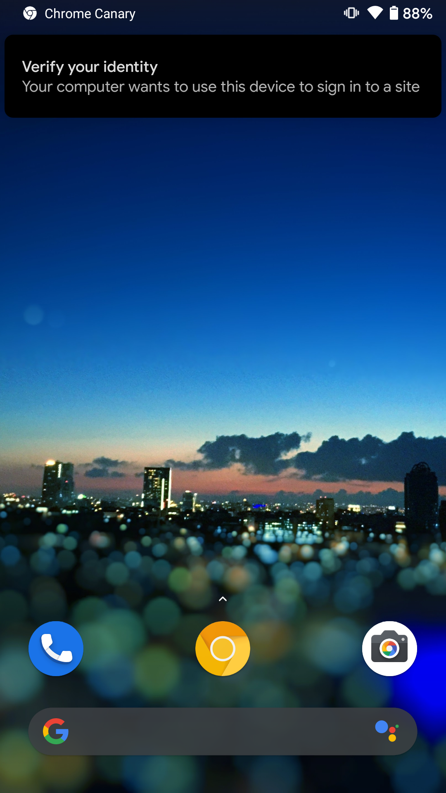

+++
title = "Previewing Chrome's WebAuthn support for caBLE v2"
description = "Observations of Google's experiment with Android phones as WebAuthn authenticators"
date = "2021-06-18T23:47:54.546Z"
categories = ["webauthn"]
keywords = ["chrome", "android", "webauthn", "cable", "bluetooth"]
hasCode = false
+++

## Setup
- https://groups.google.com/a/fidoalliance.org/g/fido-dev/c/go6GoFW27Dw/m/9flCLR5pBQAJ?pli=1

## Experience - Registration
- See "WebAuthn CaBLE screenshots" folder on desktop
- ES256 public key
- UV=true
- Attestation always "none", even when "direct"
- New transport: "cable"
- No need to pair phone to computer

