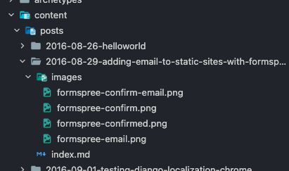

+++
title = "Supporting Hugo page bundles in Netlify CMS"
description = "Update your collections definition with a couple new values and you're good to go"
date = 2021-12-23T23:06:16.659Z
categories = ["howto", "hugo", "netlifycms"]
keywords = ["hugo", "page bundles", "netlifycms"]
hasCode = true
draft = false
+++
I recently rearranged the blog's posts file structure to take advantage of [Hugo's Page Bundles](https://gohugo.io/content-management/page-bundles/) feature. Without going into too much detail this reorganization enabled me to bundle post content into self-contained folders. Within these folders is a single **index.md** file containing the post's Markdown, as well as an **images/** folder into which all of the post's images reside:



I much prefer this to the blog's earlier setup that dumped Markdown files and images into two folders and made me find individual image URLs within each document to track which images went with which posts.

Unfortunately when I rearranged the posts I broke my [Netlify CMS](https://www.netlifycms.org/) setup and it stopped recognizing that I had any posts! After some digging around I discovered a "beta feature" called [Folder Collections Media and Public Folder](https://www.netlifycms.org/docs/beta-features/#folder-collections-media-and-public-folder). I was pleased to find out that I only needed to define a few new properties on my Netlify CMS **config.yml**'s `collections` property to get it to recognize the new folder structure:

```yaml
collections:
  - name: "posts"
    label: "Posts"
    label_singular: "Post"
    # Where to store posts (relative to the project root)
    folder: "content/posts"
    # Support Hugo page bundles that puts index.md and images in folders named by slug
    path: "{{slug}}/index"
    media_folder: "images"
    public_folder: "images"
```

Once the new `path`, `media_folder`, and `public_folder` were in place Netlify CMS started working. I even wrote this post in it to make sure everything functioned normally. So far so good!