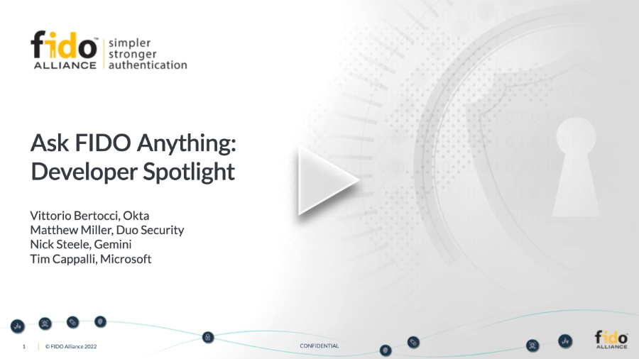

+++
title = "Ask FIDO Anything: Developer Spotlight (webinar)"
date = "2022-02-22T17:00:00.000Z"
description = "Offering guidance to developers looking to implement WebAuthn (while standing shoulder to shoulder with some heavy hitters in the authentication space)"
categories = ["presentations"]
keywords = ["fido alliance", "passwordless"]
hasCode = false
+++

## Description

With widespread platform support for FIDO, it’s now easier than ever for developers to integrate FIDO strong authentication into their websites or apps. But there are still plenty of questions developers often have before getting started. Join this Ask FIDO Anything webinar with developers that have first-hand knowledge of FIDO to get answers to all of your pressing questions!
