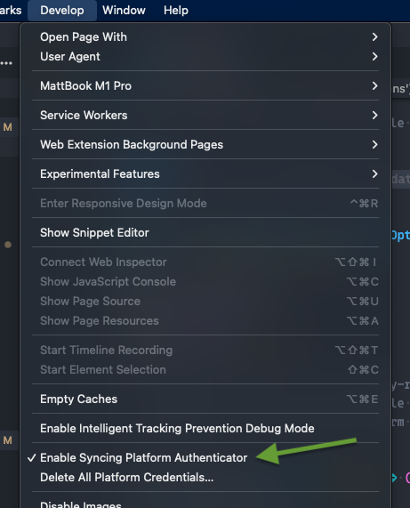
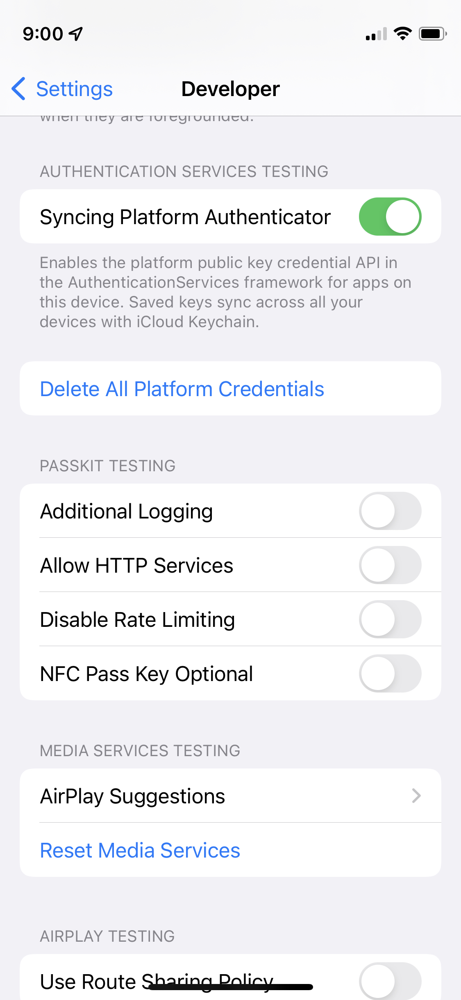
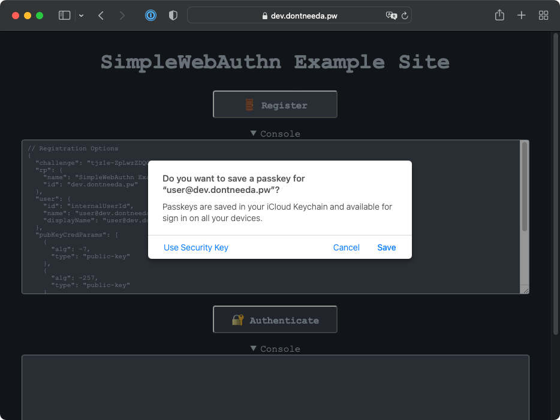
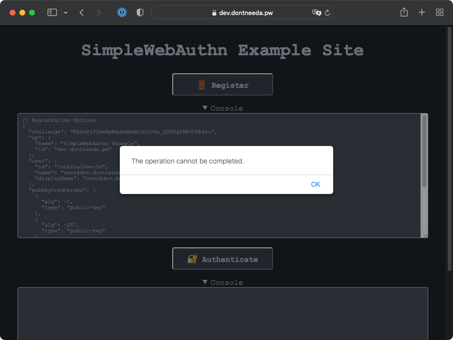
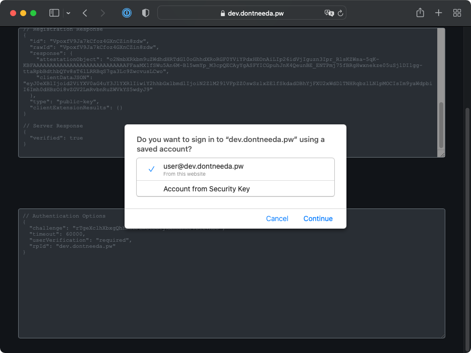

+++
title = "Previewing Apple's Passkeys"
date = "2022-03-18T05:35:32.182Z"
description = "A quick peek at Apple's solution to WebAuthn's lacking account recovery story"
categories = ["webauthn", "ios", "macos", "safari"]
keywords = ["apple", "passkeys", "webauthn"]
hasCode = true
+++

Last year at WWDC 2021 Apple [announced a tech preview of their upcoming "passkeys"](https://developer.apple.com/videos/play/wwdc2021/10106/). These were otherwise normal WebAuthn credentials, except their private key material would get synced between devices via iCloud Keychain! In one fell swoop Apple had seemingly offered up a solution to users getting locked out of their WebAuthn-protected accounts if they lost their phone.

Nearly a year later I decided to capture the current state of these passkeys. It'll be nice to have something to compare against whatever Apple ends up officially launching, maybe this year at WWDC 2022.

## Setup

Activating passkeys on macOS 12.2.1 was a simple as enabling Safari's developer tools, then clicking **Develop > Enable Syncing Platform Authenticator**:

Getting iOS 15.4 to support syncing platform authenticators was a little more involved. [Here's how Apple said to do it](https://developer.apple.com/documentation/authenticationservices/public-private_key_authentication/supporting_passkeys):

> In iOS, turn on the Syncing Platform Authenticator switch under Settings > Developer. The Developer menu is available on your device when you set it up as a development device in Xcode.

Practically speaking this meant downloading Xcode from the Mac App Store, creating a new throwaway project, then plugging my iPhone into my MacBook for a few seconds once the project finished loading. This allowed me to then go to **Settings > Developer** on my phone and flip the **Syncing Platform Authenticator** toggle to On:

## Registration - macOS

Passkey registration didn't really change how `navigator.credentials.create()` was called. So long as I allowed platform authenticators to be registered, Safari explicitly prompted me to "save a passkey":

Clicking **Save** returned a credential, and the registration ceremony successfully completed as expected.

Curiously, passkeys only supported `"none"` attestation. Requesting `"direct"` attestation resulted in an ambiguous error:

## Authentication - macOS

Options passed to `navigator.credentials.get()` were also unaffected. Worth noting was my ability to populate `allowCredentials` or leave it an empty array. Either way Safari displayed a list of passkeys so that I could "sign in...using a saved account":

Selecting a passkey from the list returned it from the WebAuthn API call, and the authentication ceremony succeeded as expected.

## Authentication - iOS

Notice how I skipped "Registration - iOS"? This is where passkeys shine through: they became immediately available to authenticate on my iPhone! This was as simple as authenticating on the iPhone afterwards:

The reverse of all of this was true too - if I cleared synced platform credentials and then registered a passkey on the iPhone, I could then authenticate on macOS a few moments later with the same credential (I *did* have to give iCloud Keychain maybe 15 seconds to synchronize the new credential).

## Closing Thoughts

I have to say I'm pretty excited for these passkeys. I think it's a great solution for WebAuthn account recovery since now it's as simple as signing into my iCloud account on a new device to regain access to all of my credentials. The fact that the synchronization happens automatically is a huge convenience win too since there's nothing to think about.

I *had* hoped this would mean the end of browser-specific credential stores on macOS for an OS-level store like on iOS, but alas, Apple seems to be keeping this exclusive to macOS Safari for now.

All in all I'm looking forward to whenever Apple goes live with this feature, it seems great for us end users 🥳
