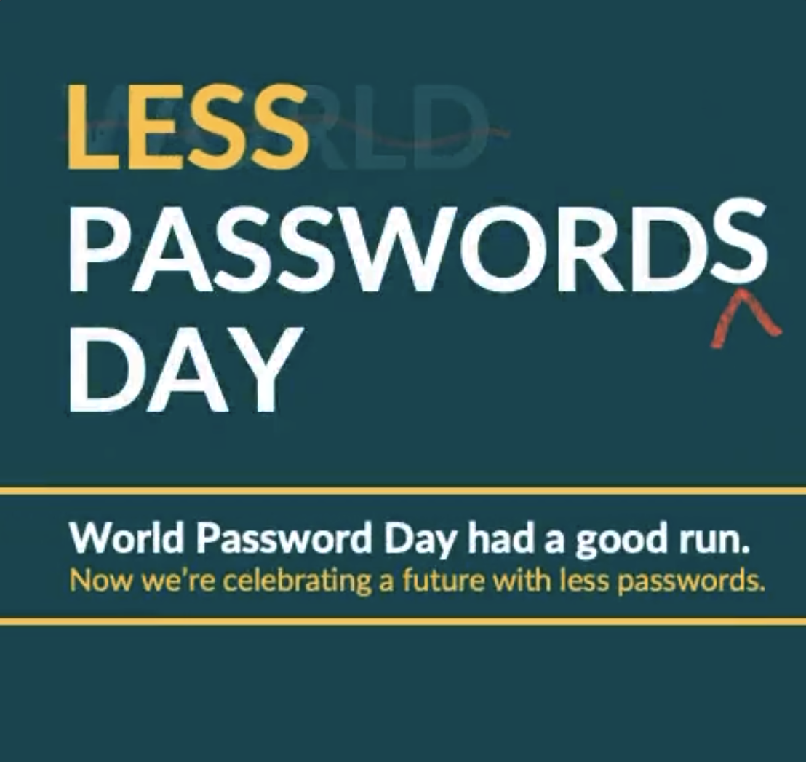

+++
title = "Of multi-device credentials and cross-device authentication"
description = "WebAuthn is gaining some cool new features, but misunderstandings abound"
date = 2022-05-07T05:07:22.567Z
categories = ["webauthn"]
keywords = ["webauthn", "passkeys", "multi-device", "credential", "cross-device", "authentication"]
hasCode = false
draft = false
+++
On May 5th, 2022 the FIDO Alliance coopted World Password Day ([created by Intel Security in 2013](https://passwordday.org/), as it turns out) with its "Less Passwords Day":

Headlining this tongue-in-cheek reveal was the actually interesting announcement that **Apple, Google, and Microsoft were all committing to support multi-device credentials and cross-device authentication within the next year!** Somehow the FIDO Alliance had figured out how to get [the big three platform vendors to publicly signal intent](https://fidoalliance.org/world-password-day-had-a-good-run-now-were-celebrating-a-future-with-less-passwords/) to support these upcoming additions to the WebAuthn spec, and all of a sudden a standards-based passwordless future seemed closer than ever.

As a bit of a refresher, back in March 2022 the FIDO Alliance released [a whitepaper on the concept of "multi-device FIDO credentials"](https://fidoalliance.org/white-paper-multi-device-fido-credentials/). This document outlined a strategy for FIDO authenticator vendors to enhance their devices with capabilities that would allow credentials to survive device loss:

> In other words, if the user had set up a number of FIDO credentials for different relying parties on their phone, and then got a new phone, that user should be able to expect that all their FIDO credentials will be available on their new phone.
>
> ...
>
> For these multi-device FIDO credentials, it is the OS platform’s responsibility to ensure that the credentials are available where the user needs them...Just like password managers do with passwords, the underlying OS platform will “sync” the cryptographic keys that belong to a FIDO credential from device to device.

This is great and all, but there's one particular detail in this whitepaper that I'm seeing [some tech blogs](https://www.theverge.com/2022/5/5/23057646/apple-google-microsoft-passwordless-sign-in-fido) [miss out on](https://arstechnica.com/information-technology/2022/05/how-apple-google-and-microsoft-will-kill-passwords-and-phishing-in-1-stroke/) as they strive to analyze these recent announcements and make sense of it all:

> Syncing FIDO credentials’ cryptographic keys between devices may not always be possible, for example if the user is using a new device from a different vendor, which doesn’t sync with the user’s other existing
> devices.

Indeed, **one early downside of the first iteration of multi-device credentials is that they'll only be synchronized within the same ecosystem.** For example, Android and Chrome OS credentials will only sync to other Android and Chrome OS devices using the same Google account, while iOS and macOS credentials will be restricted to other iOS and macOS devices on which a user was logged into their iCloud account.

Statements that a multi-device credential, "works across all devices, whether you're running iOS, Android, or Windows, and across all Apple, Google, or Microsoft services" are too ambiguous; they give readers the false impression that they'll be able to create a WebAuthn credential on a website on iOS, and then turn around and immediately authenticate on Windows with that credential some how "synchronized" to be used with Windows Hello. The truth is we're not anywhere near that, not yet anyway, and people should set their expectations accordingly.

The silver lining to all the above is that **cross-platform authentication** is coming sooner than later. Indeed, while cross-ecosystem credential synchronization may never happen, a new CTAP transport is being finalized sometime this year that will **allow for phones to be used as roaming authenticators**. As I [observed back in June 2021](/2021/06/18/previewing-chromes-cable-v2-support-for-webauthn/), Google's work on a "cable" transport will drive this initial implementation of cross-platform authentication. This means that, within the next year, it will become feasible to log into a website on Windows using a multi-device credential previously registered on your iPhone. Simply scan a QR code on the desktop browser, and then perform a WebAuthn ceremony on the phone. Upon successful completion the website on the desktop will then log you in. Neat stuff!

That's not to say that cross-platform authentication will always refer to caBLE authentication. Rather the door is now open for Apple, Google, Microsoft, and other authenticator vendors to create new means of cross-platform authentication in the future, which can then be almost immediately supported by RPs with spec-compliant implementations of WebAuthn.