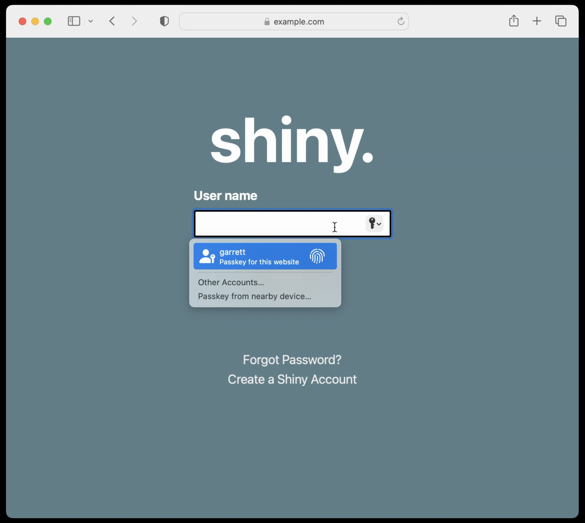
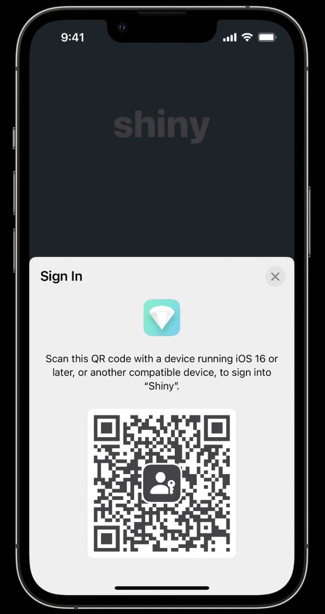
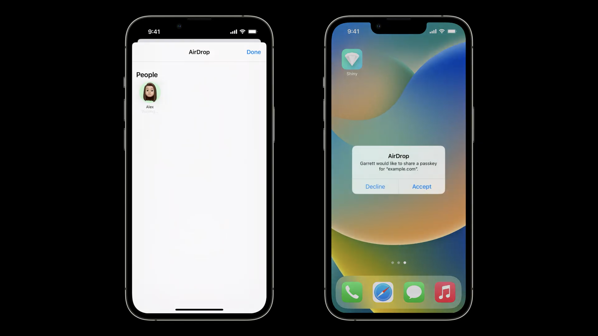
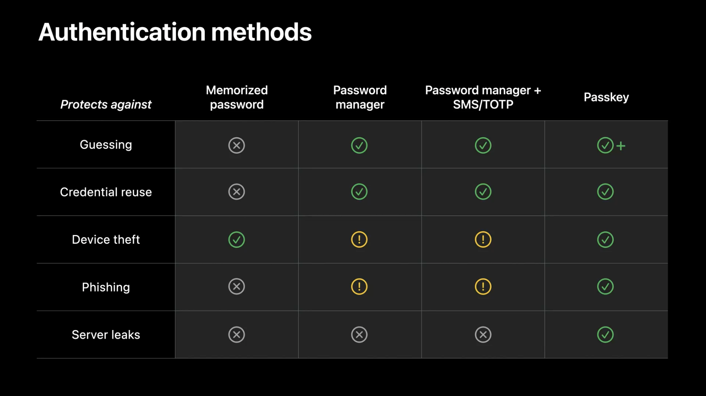

+++
title = "WWDC 2022: Meet passkeys"
date = "2022-06-10T04:19:19.958Z"
description = "Apple reveals how passkeys have evolved over the last year to offer the majority of us on the internet easy access to enhanced account security...with some caveats for larger Relying Parties."
categories = ["webauthn", "ios", "macos"]
keywords = ["webauthn", "passkeys", "apple", "ios", "macos"]
hasCode = true
+++

At WWDC 2022 Apple released a session simply titled, ["Meet passkeys"](https://developer.apple.com/videos/play/wwdc2022/10092/). In this video we finally got to see everything they've been working on since [the passkey Technical Preview debuted after WWDC 2021](). Boy, did Apple come out swinging with their support for the next generation of WebAuthn.

I started [documenting interesting bits out of the video on Twitter](https://twitter.com/IAmKale/status/1534765449677746177), but by the time I finished watching the session I decided instead to compile everything here for easier reference. What follows are my observations on material Apple has produced publicly about passkeys, and my thoughts an opinions on them as an individual passionate about the subject, with a bit of time spent thinking through the new capabilities as a member of an enterprise Relying Party.

> **NOTE:** The session focuses on both mobile and web use cases, but I'll be focusing primarily on the **web use cases**.

Let's begin!

## Conditional UI

Right out the gate Apple demonstrates functioning conditional UI! This is a [very exciting new WebAuthn capability](https://github.com/w3c/webauthn/pull/1576) that allows RP's to prompt a user to select an available WebAuthn credential when they put focus on the username and/or password field:



Apple included in the video a snippet of JavaScript code that RP's can incorporate into their site to set this up:

```js
function signIn() {
  if (!PublicKeyCredential.isConditionalMediationAvailable ||
      !PublicKeyCredential.isConditionalMediationAvailable()) {
    // Browser doesn't support AutoFill-assisted requests.
    return;
  }

  const options = {
    "publickey": {
      challenge: ... // Fetched from server
    },
    mediation: "conditional"
  };

  navigator.credentials.get(options)
    .then(assertion => {
      // Pass the assertion to your server.
    });
}
```

There's a new `"webauthn"` value that needs to be set to the `autocomplete` attribute on a text input as well:

```html
<input
  type="text"
  id="username-field"
  autocomplete="username webauthn"
/>
```

Once this is set up then Safari is ready to leverage conditional UI to prompt for passkey selection when the user begins to fill in their username, as seen in the screenshot above.

It's notable that **the code above is not proprietary to Safari**. They simply implemented conditional UI. This exact same code will eventually trigger similar autofill prompts in browsers like Chrome and Edge (Chromium) too (subject to browser-specific quirks in their conditional UI implementations.)

## Notes on autofill and "modal" support

At 19m 14s into the session Apple specifically called out conditional UI-powered use of passkeys as "autofill" support. This is in contrast to the more typical "modal" support that appears from direct execution of `navigator.credentials.get()`. The session broke down three main groups of tips for leveraging either, and identified some quirks of using passkeys within the Apple ecosystem:

### Make AutoFill requests early

- Autofill-assisted requests should execute early. RP devs should call `navigator.credentials.get()` with ` mediation: "conditional"` as soon as possible so that the browser has a chance to query for credentials before the user interacts with the username input.
- Autofill requests enjoy a longer timeout, and don't require a user gesture beyond the user focusing on an `<input>` with `"username webauthn"` in its `autocomplete` attribute.

### Modal requests require a user gesture

- Modal requests still require a user gesture to execute, so nothing changes here for existing implementations.
- Non-user-gesture or "indirect" calls to navigator.credentials.get() *can* be made once per page load, but this may lead to issues with subsequent requests based on WebKit restrictions that would require a page reload to fix. This is in line with [behavior we're seeing in the wild](https://twitter.com/IAmKale/status/1491894173053583370).

### Passkeys replace Safari's legacy platform authenticator

- Existing credentials will still work, but remain device-bound. These legacy platform authenticator-generated credentials should still work for cross-device auth, though.
- New platform credentials will be created as passkeys, which mean they're guaranteed to be discoverable credentials.
- Passkeys will _not_ provide an attestation statement during registration, which can be used to detect a passkey registration vs registration via the "legacy platform authenticator" (assuming the RP is requesting direct attestation)

## Using cross-device auth on iOS

At 21m 54s Apple incredibly shows iOS displaying a cross-device auth QR code on a mobile device. Imagine it: scanning a QR code on an iPhone with your Android phone's camera to log in on the iPhone!



I was initially surprised by this because I only pictured cross-device auth being useful for logging into sites on laptops and desktops. It's totally valid to want to auth into a site on mobile using another passkey on a second mobile device, though, and so now I'm glad to see Apple committed to launching with this feature.

## Sharing passkeys...

Another unexpected announcement was that of the ability to Airdrop passkeys to people in your contacts. For sites that don't offer multiple account creation, like home utilities websites which often only allow a single account per home, this helps passkeys reach "feature parity" with passwords, since the latter can already be easily shared in these situations to help family members log in.



For enterprise RP's, though, the fact that passkeys can be shared so easily dashes some hope that passkeys could at least be reliably associated with a specific user, if not a specific device anymore because of the default syncing between devices via iCloud Keychain sync. If Apple's upcoming passkey functionality in totality is a preview of what is to come from Google and Microsoft as well (which is likely) then enterprise RP's will need to sit down and reconsider how passkeys might fit (or not) into their security models. Perhaps the WIP [`devicePubKey` extension](https://github.com/w3c/webauthn/pull/1663) will get completed before too long, as it offers the likeliest way for RP's to get back to enforcing registration of device-bound credentials.

## Some questions...

### 1.5-factor auth?

At around the 32m 0s mark Apple makes an interesting claim about multi-factor authentication and passkeys:



> Adding [SMS, OTP, etc...] to a password-based sign-in flow makes sense, as together they can protect against more types of attacks than passwords alone. But a passkey alone protects against so much more that it doesn't need additional factors.

I can see the argument that the unphishability of an origin-bound credential makes for a superior replacement to passwords. But what about the fact that WebAuthn offered "two factors in a single gesture" to fulfill multi-factor authentication? Is there enough consensus in the security industry that a passkey, with its origin-bound, public-key-cryptography-based credential, can be a true substitute for "username + password + SMS/OTP/etc..."? Will RP's with more advanced functionality be fine with "username + passkey" instead?

### The future usefulness of requiring user verification

There's also an unexplored question of why Apple guides RP developers to always use the default `userVerification` value of `"preferred"` to, "...avoid creating a bad experience on devices without biometrics." What is the point of requesting user verification at all in normal passkey integration if a typical passkey is neither unique to a specific device ("device-bound") nor has any guarantee of being used by only one person ("user-bound")? User verification has only ever been whether the user entered their device PIN, or local biometric was able to successfully match a user's physical attribute. There is no way a passkey could report that a second user was using it because _technically_ it's the **second user**'s device that verified the **second user**, and thus the `uv` bit flag in the response would rightfully return as `true`.

## Final Thoughts

That's most of the noteworthy web-centric news about Apple's version of passkeys. After sleeping on all this news I admit I feel a little conflicted. As an end user I look at passkeys and get excited for the ability to truly start replacing my passwords with something even better than random strings. And the fact that I can still share logins with my wife with passkeys means I won't have to burn any goodwill convincing her to get on board.

But my enthusiasm as a normal end user was dampened significantly by the news that passkeys could be shared. It instantly meant work for me and others on the team to revisit assumptions we made as an enterprise RP, and re-evaluate our future WebAuthn plans.

That said, passkeys offer tangible benefits to almost the *entire population of internet users*, especially in a world without mass adoption of MFA. It's just a matter of time now before the majority of passwords get replaced by something far superior and everyone enjoys an elevated level of security. That nets out to become something definitely worth getting excited about.

The clock is now ticking: RP's have the next few months to experiment with passkeys before the feature is let loose upon the world. What's needed now are quality reference implementations to help educate RP devs on how best to handle the server-side responsibilities of WebAuthn deployment on the back end. I suppose it's time for me to finally get this https://webauthn.io revamp online...
