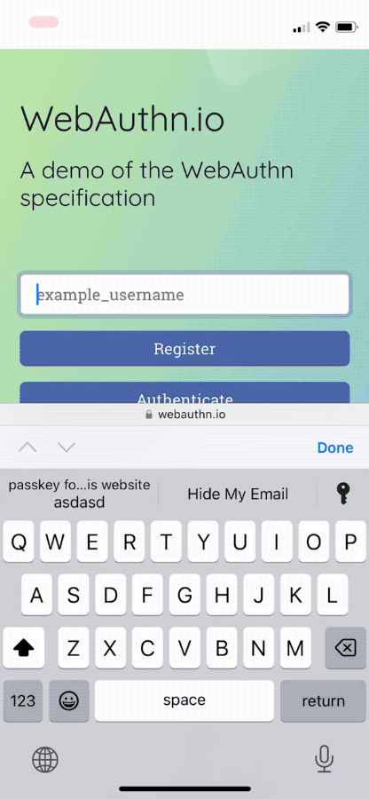
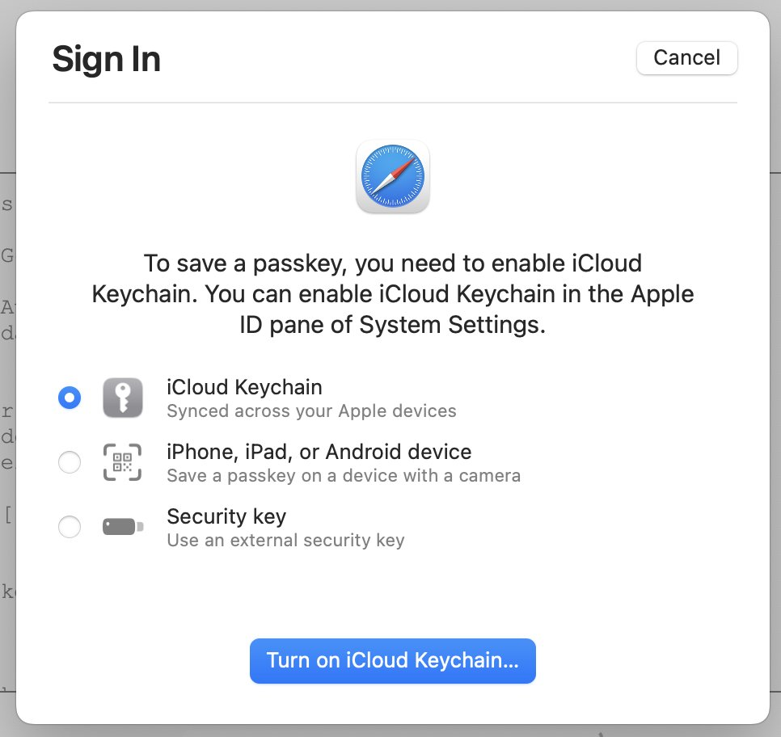

+++
title = "Apple passkeys out in the wild"
date = "2022-10-12T17:19:23.586Z"
description = "Some observations on Apple passkeys now that they've launched"
categories = ["webauthn", "ios", "macos", "safari"]
keywords = ["apple", "passkeys"]
hasCode = true
+++

It's been a few months since my last posts about Apple's passkeys implementation ([here]() and [here]()). Passkeys officially launched with iOS 16 on September 12th, and macOS Ventura betas have been stable enough that I've been able to capture some nuances of this functionality across Apple's passkey "ecosystem".

## iCloud Keychain sync is a requirement

Apple wasn't kidding when they said that iCloud Keychain sync needed to be turned on. On both iOS 16 and macOS Ventura, Safari will now block you from using the platform authenticator at all if syncing is not turned on (or you just aren't signed into an iCloud account):

### iOS



### macOS



### Regarding the use of "legacy" platform authenticator credentials

Based on internal testing, it seems to be the case that platform authenticator credentials registered on iOS 15 **can still be used on iOS 16 even if iCloud Keychain sync is disabled.** There was concern that passkeys' requirement that sync be enabled would prevent use of these now-called "legacy" credentials, and that it would mean users on devices with sync disabled via personal preference (or company policy) would get locked out of auth. That does not appear to be the case.

It's worth calling out here that allowing a previously registered user to register a passkey after upgrading to iOS 16 will see iOS opportunistically **replace** the "legacy" credential with a synced passkey. From that point on iCloud Keychain sync will become a requirement for that user to subsequently authenticate.

## Refined registration responses

[Noteworthy improvements in WebAuthn support between July]() and now include the replacement of the `"cable"` transport string with the official `"hybrid"` value. I'm also happy to report that the `credProps` extension is now fully supported as well so you can be sure that discoverable credentials are being created:

```json
{
  "id": "TQLoWBYn5g1d35k4iKZih-oWN6E",
  "rawId": "TQLoWBYn5g1d35k4iKZih-oWN6E",
  "response": {
    "attestationObject": "o2NmbXRkbm9uZWdhdHRTdG10oGhhdXRoRGF0YViY2ym4Sip1cPVGuPjtp4wgWosENMM4GwI0hSO0IsQ25ORdAAAAAAAAAAAAAAAAAAAAAAAAAAAAFE0C6FgWJ-YNXd-ZOIimYofqFjehpQECAyYgASFYIKuVvSnv-bGG8_KeikH9JNkVZGmZrfKM3Vbndet8G2-PIlggx9BQtIiDoHKmyLLAjIt_xMmzcchdnmuVLV_6vcoSMbo",
    "clientDataJSON": "eyJ0eXBlIjoid2ViYXV0aG4uY3JlYXRlIiwiY2hhbGxlbmdlIjoiQUFzU3lMa09oZ1YyOTZ2aUcwZXFBNF82ZzRQdlY4TGtZb1pxSG15RW9oNCIsIm9yaWdpbiI6Imh0dHBzOi8vZXhhbXBsZS5zaW1wbGV3ZWJhdXRobi5kZXYifQ"
  },
  "type": "public-key",
  "clientExtensionResults": {
    "credProps": {
      "rk": true
    }
  },
  "transports": [
    "internal",
    "hybrid"
  ]
}
```

## Refined authentication responses

I'm also happy to report that Conditional UI authentications now correctly return `uv: true` [instead of the `uv: false` they reported back in July]() when user verification is required.

## Outstanding issues

So far there are two remaining issues with passkeys in iOS and macOS Ventura:

### iOS

Attempting to trigger a modal auth after initializing conditional UI in the background will raise a `NotAllowedError` **on the modal auth attempt** if you try to abort the first conditional UI call.

I prepared a basic recreation of the issue over on GitHub: https://github.com/MasterKale/SimpleWebAuthn/discussions/282#discussioncomment-3789634

I ended up submitting feedback to Apple on October 2, 2022 about this as **FB11639511**.

### macOS Ventura (Beta 8)

In a strange turn of events, Safari 16.1 on macOS Ventura Beta 8 [won't reject the Promise returned from a conditional UI call](https://github.com/MasterKale/SimpleWebAuthn/discussions/282#discussioncomment-3789726) to `navigator.credentials.get()`. This means if you wrap it in a `try / catch` the `catch` won't evaluate, so you'd never know when the conditional UI request is aborted (it should be rejected with an `AbortError`.)
