+++
title = "Previewing Google's version of passkeys"
date = "2022-10-14T03:50:35.871Z"
description = "A sneak peek at Google's upcoming support for WebAuthn multi-device credentials and cross-device authentication"
categories = ["webauthn", "android", "chrome"]
keywords = ["google", "passkey", "android"]
hasCode = false
+++

On October 12, 2022 [Google announced the availability of a beta version of their upcoming passkeys implementation](https://android-developers.googleblog.com/2022/10/bringing-passkeys-to-android-and-chrome.html). This included instructions for [opting-in to a beta version of Google Play Services](https://developers.google.com/android/guides/beta-program), as well as announcing the availability of [Chrome Canary 108](https://www.google.com/chrome/canary/) with better default support for Conditional UI (i.e. there's no more need to start Chrome Canary with the `WebAuthenticationConditionalUI` feature flag.)

In typical fashion I dive into the new functionality as best I can and try to pull out insights to common questions that I, especially as a Relying Party (RP) developer at my day job, need to answer in order to best support this next wave of passkey implementation. I want to emphasize that **what I write about below is specific to Google's "ecosystem"**; it's the differences between ecosystems that are more noteworthy than their similarities.

By the way, below I'll often mention `be`. This is an abbreviation of "backup-eligible", in reference to the corresponding flag in authenticator data that indicates a credential's ability to be used on other devices. A `be` flag set to `true` is an easy indicator that a credential is a passkey.

Another common abbreviation will be `uv`, which means "user verification". This is another reference to a corresponding flag in authenticator data that indicates whether the authenticator verified the user's identity. User verification must take place (i.e. return `true`) when using WebAuthn for true passwordless or usernameless authentication.

## Android - Q & A

First off I'll start with Android and its upcoming support for passkeys. This update is notable for its huge overhaul of Android's FIDO2 support. Additionally, since Android is an OS instead of an application, it is the only part of Google's announcement that is capable of **creating passkeys that can get synced** for use across other devices running Android (and eventually ChromeOS.)

Let's begin.

### What happens when you request direct attestation?

Requesting `"direct"` attestation returned a passkey with an `"android-safetynet"` attestation statement...

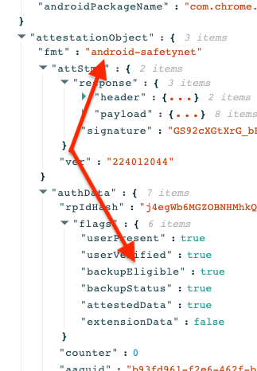

This was unexpected! When Google [gave a sneak peek of their plans for passkeys back in June](https://groups.google.com/a/fidoalliance.org/g/fido-dev/c/nhpxExcofb8/m/pd_SAJsnAwAJ?pli=1) they said that attestation would **not** be supported:

> When we launch passkey support for Android, discoverable
> credentials will be supported and discoverable credentials will be
> passkeys: synced to the user's account. But non-discoverable
> credentials will remain untouched. When a non-discoverable credential
> is created it will continue to be hardware bound, and a SafetyNet
> attestation will continue to be returned.

> Passkeys on Android will not initially have any attestation. If we add
> an attestation in the future it will be in a new format that is common
> across different Google products. The attestation for non-discoverable
> credentials will likely transition to this new format in the future.

I asked around about this, and it was [confirmed by Google that the return of an attestation statement with a discoverable credential is unintentional](https://twitter.com/agektmr/status/1580694515551154176), and will be fixed before general availability.

### Can you require discoverable credentials?

Requiring a discoverable credential during registration from an Android platform authenticator used to immediately fail the WebAuthn ceremony.

Android's upcoming passkey support naturally includes support for requesting discoverable credentials. And in fact passing `"preferred"` or `"required"` for the `residentKey` option during registration is the only way to ensure the creation of a passkey.

### What happens if you don't want users to register passkeys?

On the flip side, RP's can still request the creation of device-bound credentials on Android. Simply pass `"discouraged"` for the `residentKey` option during registration and you will get back a device-bound credential with `be:false`.

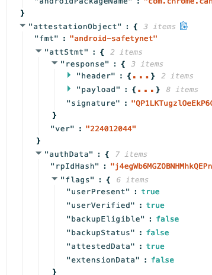

Google was clear from the start that passkeys could be opted out of via `residentKey: "discouraged"`, and they have indeed delivered on this.

### Does Android provide uv:true from Conditional UI?

Yes, Android will return `uv:true` after a user authenticates via conditional UI.

(For a bit of context here a bug in macOS Ventura beta's Safari prevented conditional UI from returning `uv:true` when using the platform authenticator which always performs user verification. It's since been fixed, but was still top-of-mind for me so I included a test for it with Google's implementation.)

### Do you get be:true on Chrome on desktop?

Based on my testing I have to say it isn't currently possible to generate passkeys in Chrome. No combination of registration options returned anything but `be:false` indicating the credentials would never leave the device.

This makes sense to me since Chrome is a browser application. We should all want credential keypair synchronization to happen only at the OS-level because of how much harder it makes it for attackers to exfiltrate keypairs from compared to an application running in user space. For now we should only expect to be able to use passkeys in the Google ecosystem as multi-device credentials on Android and ChromeOS devices.

### What transports do you get back?

When I created passkeys on my Android device I received back `["internal", "hybrid"]` for transports.

Chrome continued to return `["internal"]` for its single-device passkeys on macOS.

### Does Android support the devicePubKey (DPK) extension?

I have it on good authority that RP's can begin to experiment with DPK support starting in Chrome Canary 108. Make sure to enable the **#enable-experimental-web-platform-features** flag in `chrome://flags`:

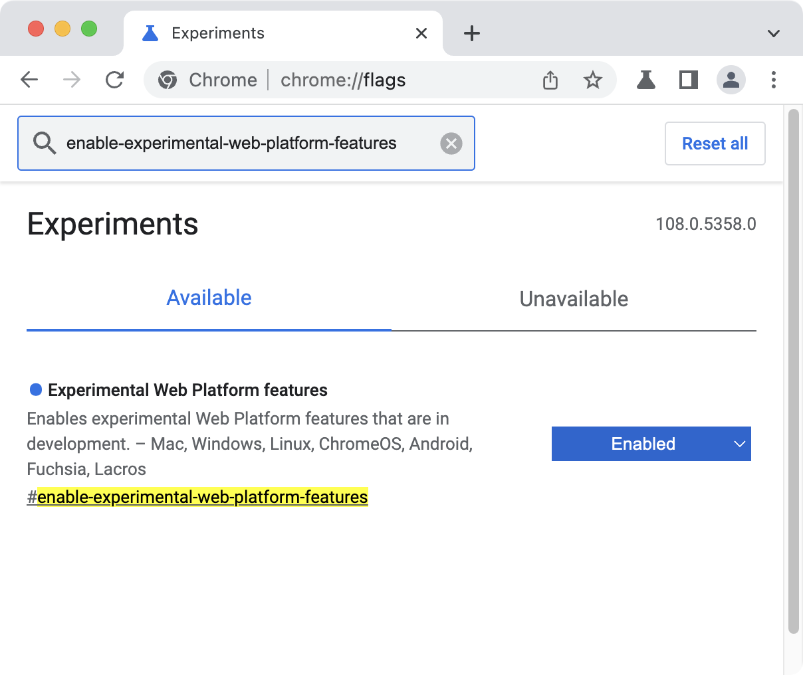

~~Despite a few attempts I was never able to get back a device public key. I'll update this section with more info if/when I can get it working.~~

[Google's own Adam Langley](https://www.imperialviolet.org/) helped clarify that I needed to turn on the feature flag in Chrome Canary **and then perform hybrid registration/authentication using my Android device!** Once I started using hybrid auth I had no problem requesting and receiving DPKs.

**Request Options:**

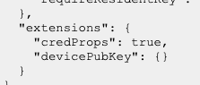

**Authenticator Response:**

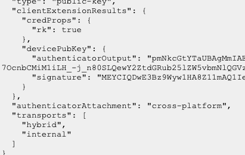

## Android visual review

Let's finish up the Android section with some screenshots of the new UI that users will see when using passkeys on Android (admission: I enjoy collecting these screenshots to go back after launch and see how things have evolved!)

### Registration

Registration is a two-step process. First, the user is asked to confirm that they want to create a passkey:

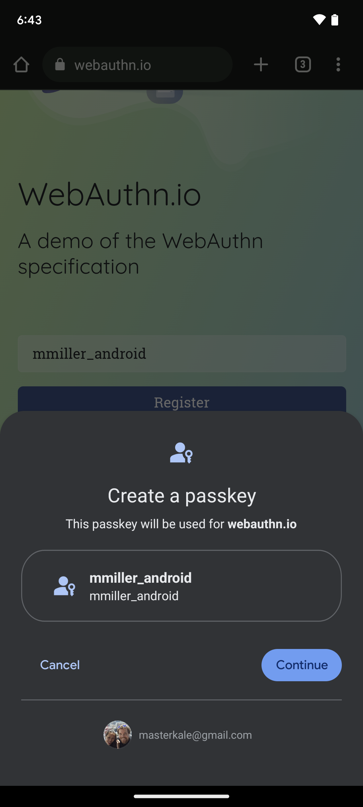

If it's the first time the user is setting up passkeys, then Google will ensure that the user has a screen lock set up to help keep passkeys encrypted at-rest on- and off-device:

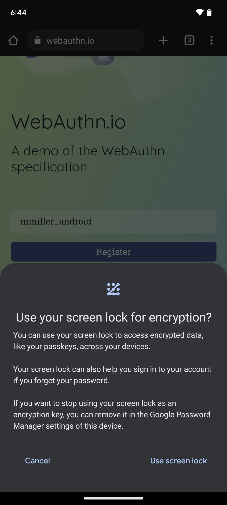

Tapping "Use screen lock" takes the user to the device's PIN/biometric interaction screen (that resists screenshotting) to make sure a screen lock is configured before asking the user to use it.

Once this is complete then the website gets back a WebAuthn response as expected.

### Authentication

When attempting to authenticate, Android pops up the modal to confirm that the user wants to use the corresponding passkey:

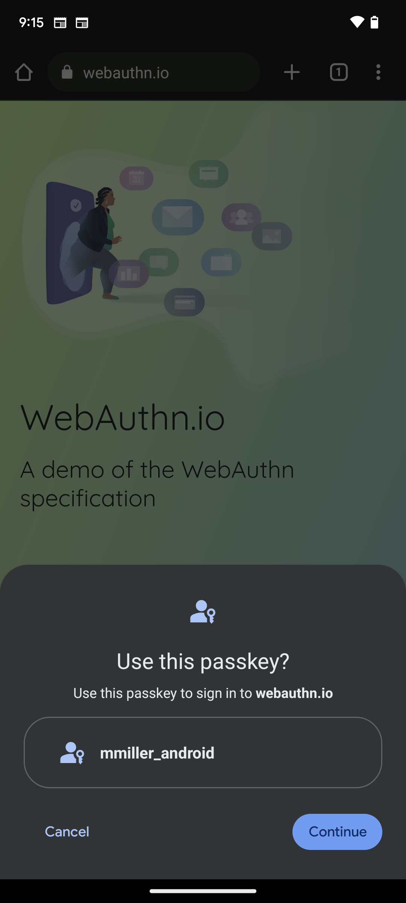

Tapping "Continue" takes the user to the device's PIN/biometric interaction screen that resists screenshotting. Completing the screen unlock interaction then completes the WebAuthn ceremony, and the website gets its response to validate as usual.

### No passkeys available

If you attempt to authenticate when no passkeys are available for the site, then Android will notify you accordingly:

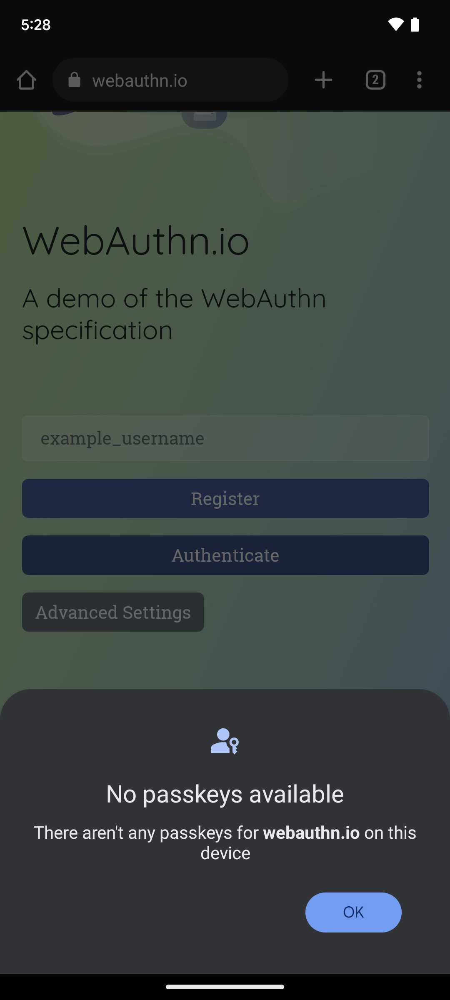

## Desktop Chrome visual review

We've pretty thoroughly covered Android's upcoming passkey functionality support. Now, let's take a minute to preview Chrome's related upcoming UI changes that will impact many desktop users of WebAuthn.

### Registration

#### Platform authenticator

After confirming which platform authenticator the user wants to register...

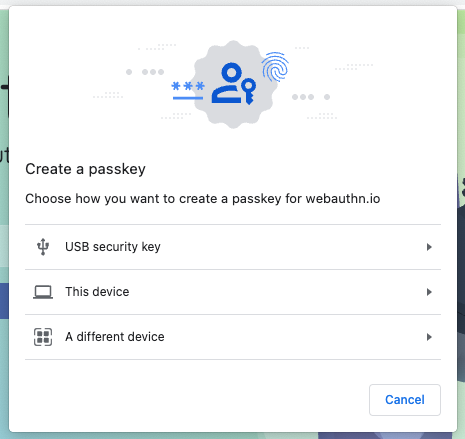

...Chrome introduces a new confirmation dialog:

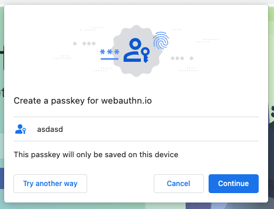

This will probably trip up many RP developers who click through registration in Chrome so much it becomes second nature (adapting to the new screen shouldn't take long though!)

One detail I like about this updated UI is confirmation of where the credential will reside:

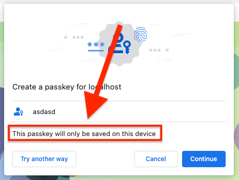

I can't see any reason for this to say anything other than "this device" any time soon because Chrome can't generate multi-device credentials, but if that day comes then this would be a good way to confirm.

Continuing along, the user will be prompted for a platform authenticator interaction as usual to complete the ceremony:

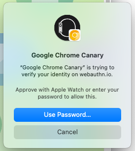

#### Security keys

Security key registration received a bit of a UI overhaul as well:

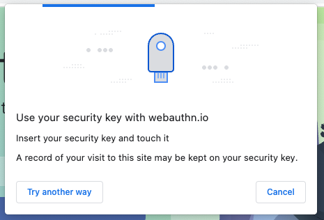

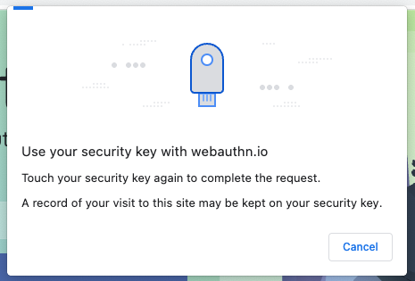

And if you attempt to re-register an authenticator then Chrome will let you know:

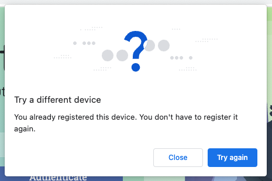

### Authentication

#### Platform authenticator

UI changes during authentication are most obvious when the RP allows a user to present a credential (a.k.a. "usernameless" auth):

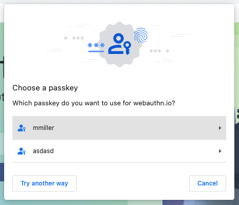

Platform authenticator interaction uses the typical prompt (it must be some kind of native OS-level window):

#### Security keys

The security key flow received similar polish to registration:

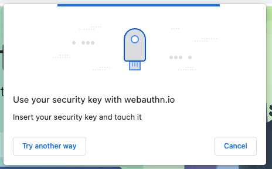
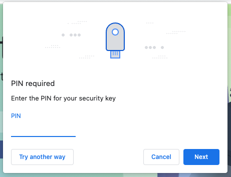
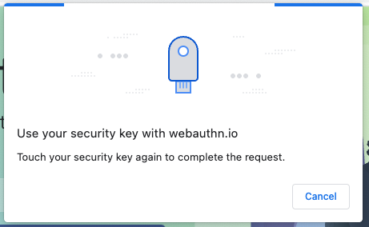

### Conditional UI

Chrome's conditional UI prompt is pleasant to look at (it's the same as the password autofill, sure, but the favicons next to each passkey is a nice touch):

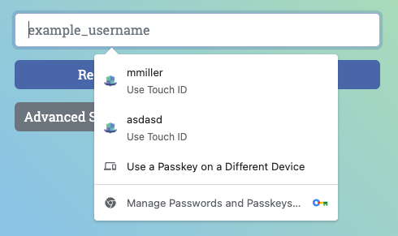

### Hybrid authentication

Rest in piece, hybrid auth dinosaur:

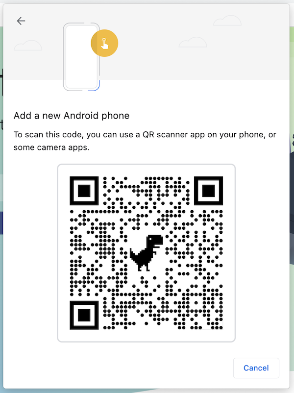

It's been replaced by a more streamlined QR code modal with new passkey iconography and a reference now to "another device":

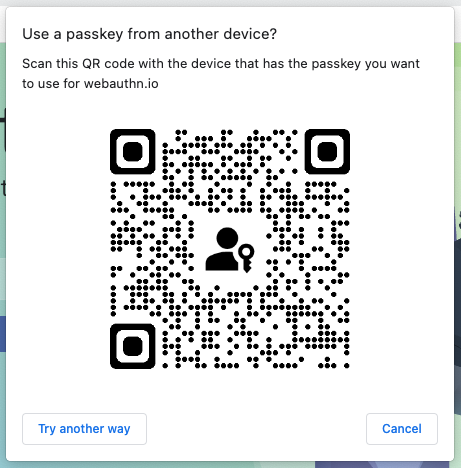

### Ceremony timeout

And for good measure, here's the new timeout screen that appears when a user waits to long to complete a ceremony:

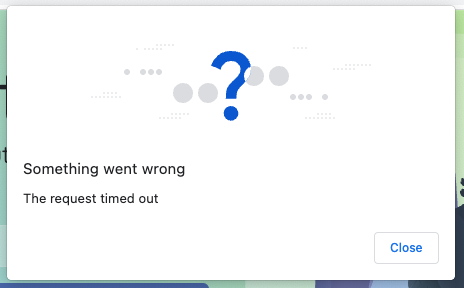

### Managing passkeys

Mercifully Chrome Canary includes some basic passkey management, at least in macOS:

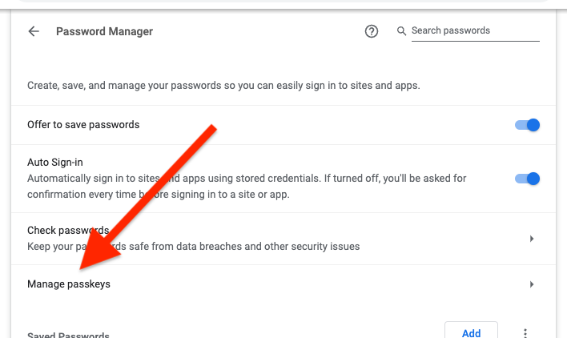

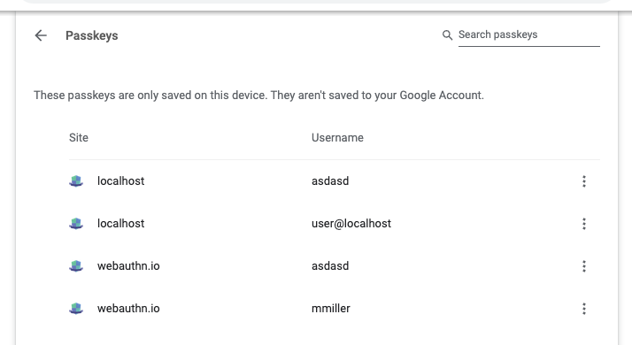

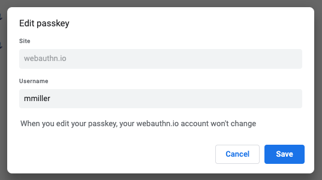

There's nothing in WebAuthn that's ever prevented an authenticator from letting users change the username associated with a discoverable credential. What's unexplored for now is what an RP is to do afterwards when the updated credential is used for authentication and the username returned from WebAuthn differs from the server-side username. Nor how to update a discoverable credential's username if a user changes theirs within the RP's website.

## Security considerations

Syncing credential private key material across devices naturally calls into question the steps that Google takes to secure access to users' Google accounts. With the debut of backup-able passkeys, attackers looking to break into a WebAuthn-protected system can now **also** target the victim's cloud account. If the cloud account is owned then all passkeys and the access they grant come along with it unless additional steps are taken to prevent those passkeys from then being used.

Google followed up their beta announcement with a second article, "[Security of Passkeys in the Google Password Manager](https://security.googleblog.com/2022/10/SecurityofPasskeysintheGooglePasswordManager.html)", that goes into a lot of detail on how exactly Google stores and protect passkeys. It should answer most questions that security-minded RP's will continue to have as they evaluate whether passkeys are right for them.

If you read nothing else from the article, at least read this excerpt:

> **Passkeys in the Google Password Manager**

> On Android, the Google Password Manager provides backup and sync of passkeys. This means that if a user sets up two Android devices with the same Google Account, passkeys created on one device are available on the other. This applies both to the case where a user has multiple devices simultaneously, for example a phone and a tablet, and the more common case where a user upgrades e.g. from an old Android phone to a new one.

> Passkeys in the Google Password Manager are always end-to-end encrypted: When a passkey is backed up, its private key is uploaded only in its encrypted form using an encryption key that is only accessible on the user's own devices. This protects passkeys against Google itself, or e.g. a malicious attacker inside Google. Without access to the private key, such an attacker cannot use the passkey to sign in to its corresponding online account.

> Additionally, passkey private keys are encrypted at rest on the user's devices, with a hardware-protected encryption key.

> Creating or using passkeys stored in the Google Password Manager requires a screen lock to be set up. This prevents others from using a passkey even if they have access to the user's device, but is also necessary to facilitate the end-to-end encryption and safe recovery in the case of device loss.

## Conclusion

All in all I like what I'm seeing. I especially appreciate the care Google is demonstrating here in giving RP's the power to choose to opt out of the creation of multi-device credentials. I don't think it's a capability that many RP's should use, honestly (the account recovery that passkeys will generally deliver in all ecosystems will reduce a lot of customer lockout support requests for SMB's, for example), but for enterprise users it's a modicum of welcomed control compared to other ecosystems that don't empower RP's with such a choice.

And speaking aesthetically for a second, Chrome's improvements to the general browser modal definitely make WebAuthn feel more approachable. I look forward to these improvements gradually making their way into Chrome Stable later this year.
