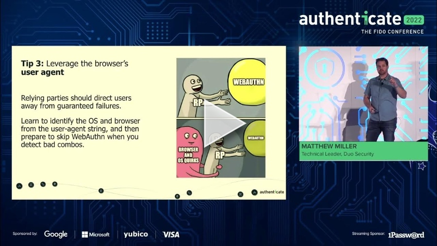

+++
title = "Tips for Painless Passwordless @ Authenticate 2022"
date = "2022-10-17T17:00:00.000Z"
description = "My debut on the passkeys stage"
categories = ["presentations"]
keywords = ["Authenticate 2022", "passwordless"]
hasCode = false
+++

## Description

You've decided to "go passwordless", but your users are confused by it all:

- "Why is my browser asking me to choose between Security Key or This Device?"
- "Why does the site show an error when I try to log in with my phone?"
- "I registered in Chrome, but Safari won't let me log in…help!"

Though Relying Parties have almost no ability to customize the browser modals that walk users through WebAuthn ceremonies, there are plenty of techniques you can use to craft a pleasant passwordless experience. Join me for some time-saving tips to help you tailor the registration and authentication ceremonies to remove confusion and empower your users to securely go about their day.

## Links

- Slides: [Authenticate 2022 - Tips for Painless Passwordless.pdf](images/Authenticate%202022%20-%20Tips%20for%20Painless%20Passwordless.pdf)
