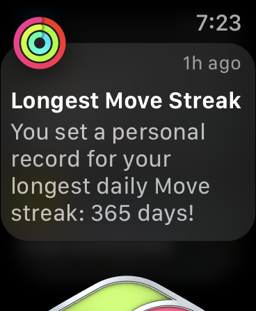
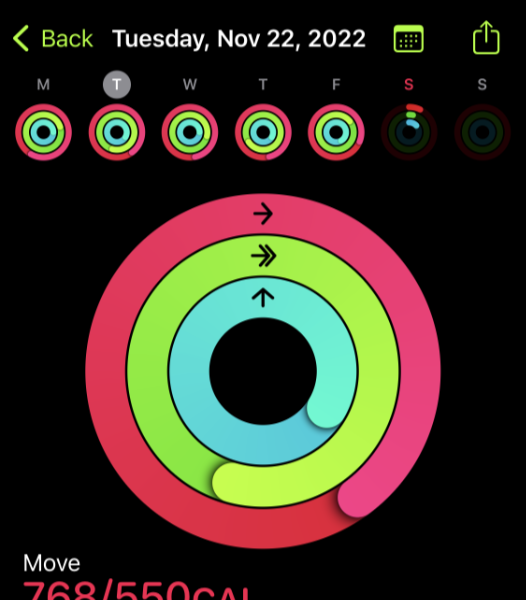

+++
title = "Closing My Rings"
date = "2022-11-26T17:15:32.633Z"
description = "Celebrating 365 days of closing all three Apple Watch rings"
categories = ["misc"]
keywords = ["apple watch", "exercise"]
hasCode = false
+++

A year ago today, for no real reason I thought, "can I close all three rings on my Apple Watch for a whole year?"

365 days later, on November 22 2022, the answer is, "yes, I can!" 🥳

The rings represent the daily activity goals I'd set for myself:

- 550 active calories
- 35 minutes of exercise
- 12 hours of standing

I'm honestly really surprised that I was able to pull it off during a pandemic. I've resisted most attempts throughout my life to start and maintain an exercise routine, but this time around it stuck. It really helped that just over two years ago we purchased a [collapsible stationary bike](https://www.xterrafitness.com/bikes/fb-350-bike) that made sense for our small condo. After becoming a father a year later I discovered I could easily move the bike in front of the TV and pair it with my PS5 to carve out some much-needed daily dedicated gaming time. It became all but a foregone conclusion then that I could succeed in my goal.

The biggest challenge was getting in those exercise minutes. When we'd stay overnight somewhere, whether with relatives or towards the end when I had a business trip or two, Apple's Fitness+ subscription saved the day. They had plenty of yoga and pilates exercises that I could do on a towel instead and have it all count towards those 35 daily exercise minutes. And getting COVID in Maui almost ended the run prematurely, but I was almost 300 days in and by then I wasn't going to let that stop me.

And now that I've pulled it off, I'm not sure what to do. Here's to Year 2? 🤔
