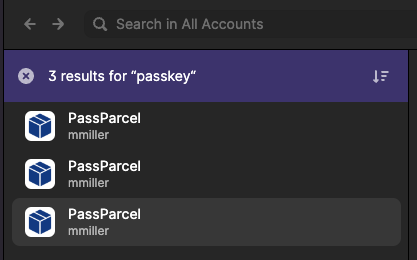
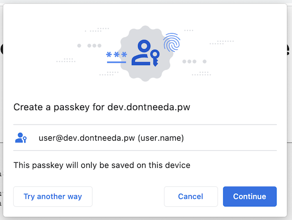
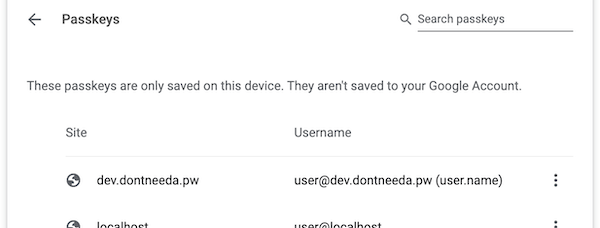
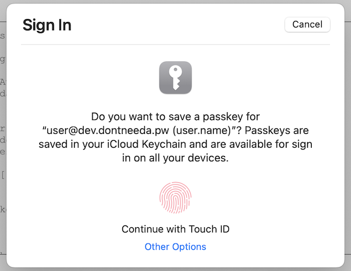
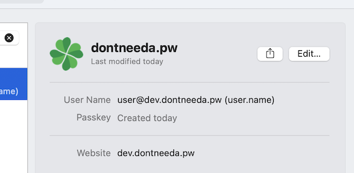
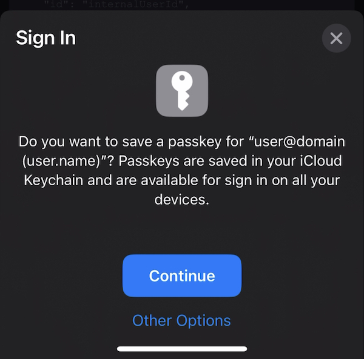
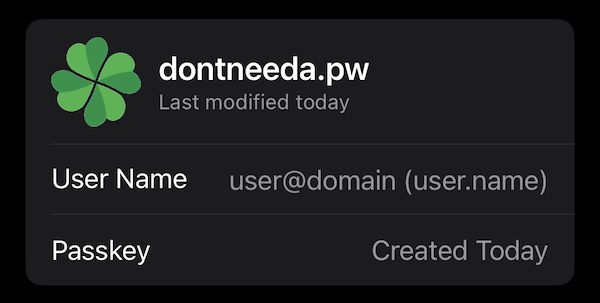

+++
title = "Controlling the Name Displayed During WebAuthn Registration (and Authentication)"
date = "2023-02-14T05:38:28.616Z"
description = "WebAuthn lets Relying Parties specify a user's name, as well as a display name. Which of these is shown across today's browsers and authenticators?"
categories = ["webauthn"]
keywords = ["webauthn", "chrome", "safari", "windows hello", "android", "macos"]
hasCode = false
+++

WebAuthn defines two possible values that Relying Parties can set to help users understand for which account they're registering a credential and using in subsequent authentications:

- `user.name` ([spec](https://www.w3.org/TR/webauthn-2/#dom-publickeycredentialentity-name))
- `user.displayName` ([spec](https://www.w3.org/TR/webauthn-2/#dom-publickeycredentialuserentity-displayname))

It was unclear to me from reading the spec how exactly I was supposed to use either value:

**user.name**

> When inherited by `PublicKeyCredentialUserEntity`, it is a human-palatable identifier for a user account. It is intended only for display, i.e., aiding the user in determining the difference between user accounts with similar `displayName`s. For example, "alexm", "alex.mueller@example.com" or "+14255551234".

**user.displayName**

> A human-palatable name for the user account, intended only for display. For example, "Alex Müller" or "田中倫". The Relying Party SHOULD let the user choose this, and SHOULD NOT restrict the choice more than necessary.

Practically speaking, it seemed easy for an RP to misconfigure these values and get users into a state in which it's difficult to know, for example, which environment/deployment/etc... a particular passkey was good for:

**Chrome**

**1Password**

**Safari**

Which credentials are still valid? Which can I delete? From these real-world examples it seems impossible to tell.

I decided to attempt registration across the most common platforms and browsers and record which of these two values made it into UI that users actually see. I was also curious to see which of the values appeared in credential management UI. In the end I hoped to understand how I might better leverage these values to help users manage their passkey collections.

## Chrome M109 (macOS 13.2)

Chrome used `user.name` for both registration and passkey management.

**Registration:**

**Management:**

## Safari 16.3 (macOS 13.2)

Safari also used only `user.name` for registration and passkey management.

**Registration:**

**Management:**

## Windows Hello (Windows 11 21H2)

Windows Hello solely used `user.name`.

**Registration:**

**Management:**

N/A

NOTE: I couldn't find passkeys management in Chrome on Windows, but I've been informed I need to be on Windows 11 22H2 to see it. I'm updating now and will update this section when I can grab a screenshot (it'll probably look like macOS Chrome above)
{.note role="note"}

## iOS 16.3

iOS too limited itself to using `user.name` for registration and management.

**Registration:**

**Management:**

## Android 13

Android was the only platform that leveraged both `user.name` and `user.displayName`.

**Registration:**

**Management:**

## Conclusion

Based on what I observed today it appears that **`user.name` is an RP's best option for differentiating credentials** that use the same username but only work for specific environments/deployments/etc...

(BTW I submitted a GitHub issue to the WebAuthn spec [related to differentiating credentials via a new "`note`" value](https://github.com/w3c/webauthn/issues/1852) in registration options. Based on what I'm seeing above, though, I can agree with Yubico's John Bradley that there's [an opportunity for clients and platforms to also leverage `user.displayName`](https://github.com/w3c/webauthn/issues/1852#issuecomment-1429036058) instead of adding anything new.)
