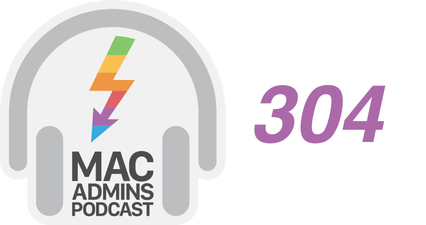

+++
title = "Mac Admins Podcast Episode 304: webauthn and webauthn.io"
date = "2023-02-27T07:02:37.720Z"
description = "Helping spread the passkey gospel, one podcast at a time."
categories = ["podcasts"]
keywords = ["mac admins podcast", "webauthn", "webauthn.io"]
hasCode = false
+++

[I was asked to be a guest on the Mac Admins Podcast, and Episode 304 is now live](https://podcast.macadmins.org/2023/02/27/episode-304-webauthn-and-webauthn-io/)! Here's their summary of all the WebAuthn-related things we talked about:

> Apple’s version of passkeys are the latest piece of a sprawling identity picture for the Apple platform that isn’t widely supported just yet – which is a perfect time to start learning about it.  Passkeys aren’t just Apple; they’re supported on Mac, Windows, Android, and even in our browsers. This evolution in WebAuthn’s capabilities means we don’t need physical tokens (although that’s still an option) to have a second factor in auth flows – nor is that other factor tied to a phone number, making it more secure. But for admins, there are plenty of questions we need to figure out. What do we have instead of a username and what is there in lieu of a password? As we develop solutions that work with webauthn, we often use a reference implementation at webauthn.io to test functionality. Our guest today is one of the people behind that site, Matt Miller.

It was an honor to be asked to appear on an established show like theirs, and I hope I was able to shed some light on WebAuthn for those who've wanted to get a bit deeper.

Their site includes some additional links, a transcript, and a web player to listen to the episode. It's also available in your preferred podcast app - I listened to it in [Pocket Casts](https://pca.st/3elk3dql) no problem 👍
