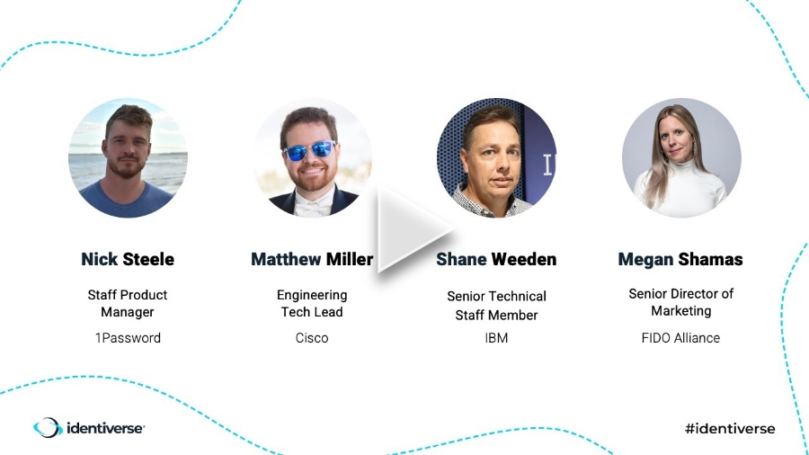

+++
title = "Go Passwordless with Passkeys @ Identiverse 2023"
date = "2023-05-30T17:00:00.000Z"
description = "A workshop on how to gradually incorporate passkeys into your auth"
categories = ["presentations"]
keywords = ["Identiverse 2023", "passwordless"]
hasCode = false
+++

## Description

Over the past few years we've seen a meteoric rise in MFA adoption. It's been driven in part by the pandemic and by development of easier authentication experiences for end users. With passkeys and conditional UI now here, logging in with FIDO2 is going to get faster and more accessible for users. How should developers get started? Join two FIDO WebAuthn experts to get hands-on with going passwordless and learn how to leverage new FIDO features to provide streamlined auth flows with less passwords today.

## Links

- Slides: [Authenticate 2023 - Go Passwordless with Passkeys.pdf](images/Authenticate%202023%20-%20Go%20Passwordless%20with%20Passkeys.pdf)
