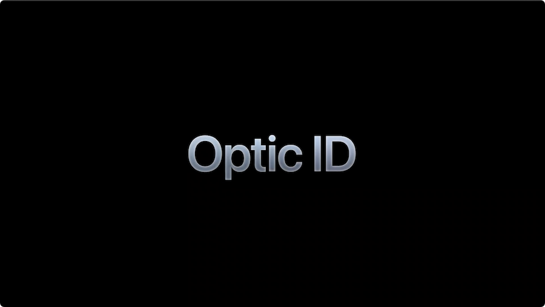
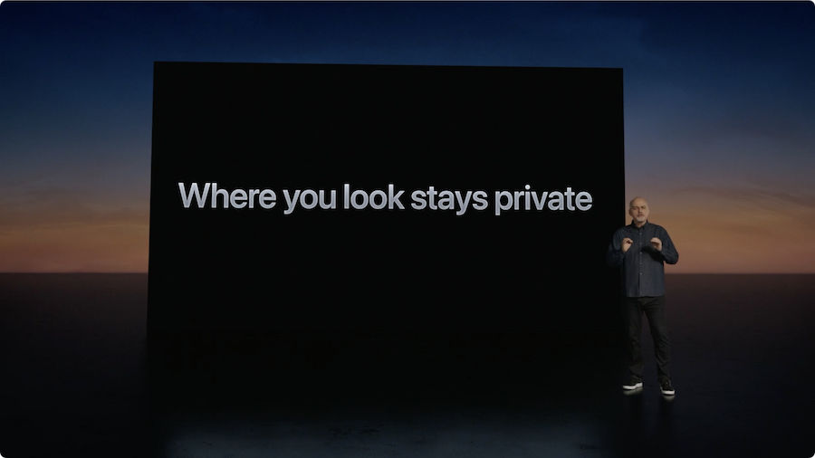

+++
title = "WWDC23: Optic ID"
date = "2023-06-07T05:45:44.193Z"
description = "An unexpected new biometric modality comes to the Apple ecosystem"
categories = ["apple", "wwdc", "webauthn"]
keywords = ["Apple", "Optic ID", "Vision Pro"]
hasCode = false
+++

Apple's [Vision Pro](https://www.apple.com/apple-vision-pro/) hardware announcement at WWDC23 was of course quite the spectacle. After years of rumors Apple finally announced their newest hardware platform, a fully standalone pair of ski goggles that seems to offer [a delightful AR/VR user experience](https://arstechnica.com/gadgets/2023/06/hands-on-with-apple-vision-pro-this-is-not-a-vr-headset/) to tech reporters who managed to snag some time with it.

One thing that stood out to me, though, was the announcement of Optic ID. This new biometric modality, in the same vein as Touch ID or Face ID, is touted as offering the same level of protection we've come to expect from those "use Touch ID/Face ID" prompts on iOS, iPadOS, and macOS. Except instead of using your fingerprint or face scan, it uses your iris!

Apple reassured us that iris biometric data never leaves the device (just like Touch ID/Face ID), and is only accessible to the Secure Enclave (just like Touch ID/Face ID). And even better, eye position tracking data also remains on the device, only getting translated to coordinates when you tap your fingers to "click" something. All in all this sounds like the expected, sane, and my preferred way of leveraging biometric data to authorize privileged actions on your device.

In hindsight this is an obvious way to offer local device-driven biometric-based authorization without requiring the user to constantly take off their headset to approve an action with their iPhone or MacBook.

What I'm curious to find out now is how seamless this will work with current platform authenticator flows in WebAuthn. I assume it'll be effortless for existing WebAuthn deployments, given it's between the OS and Safari to negotiate Secure Enclave invocation. And passkeys should transfer to visionOS too, right?

I look forward to 2024 when I might get a chance to test Optic ID out for myself (provided I can expense a $3499 pair through work 🥵💸)

## Optic ID Announcement Transcript

I thought it might come in handy when drafting this post to transcribe the entire portion of the Keynote dedicated to Optic ID. It didn't, but I already wrote it all out so here's the segment in its entirety:

> Another is the relentless focus we place on privacy and security. And that starts the moment you put on Apple Vision Pro where it authenticates you with a secure, yet effortless system called Optic ID.
>
> This new system uses the uniqueness of your iris, which is distinct even with identical twins, to instantly unlock Vision Pro. Optic ID data is encrypted, never leaves your device, and like Face ID is only available to the Secure Enclave processor. Optic ID works seamlessly with features like Apple Pay, App Store purchases, and password autofill.
>
> We also engineered privacy into Vision Pro in some important ways. For example, where you look is very personal. It can give away something about what you're thinking. In Apple Vision Pro, where you look stays private. Eye input is isolate to a separate background process so apps and websites can't see where you are looking. Only when you tap your fingers do results get communicated, just like a mouse click or tap on other Apple devices. And camera data is processed at the system level so individual apps don't need to see your surroundings.
>
> You can enjoy the experiences of Vision Pro knowing our world-class security and privacy features are right there with you.

You can [jump to 1:58:43 in the WWDC23 Keynote](https://youtu.be/GYkq9Rgoj8E?t=7123) to see the Optic ID announcement for your self.
