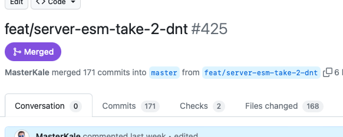

+++
title = "Getting to SimpleWebAuthn v8.0.0 with dnt"
date = "2023-08-22T22:31:28.034Z"
description = "From Node-only to Node, Deno, Bun, and more using dnt"
categories = ["typescript"]
keywords = ["simplewebauthn", "node", "deno", "dnt", "typescript", "monorepo", "pnpm"]
hasCode = true
+++

SimpleWebAuthn debuted in May 2020 as three interconnected libraries that aimed to make WebAuthn simpler to use across browsers and "NodeJS + CommonJS" applications. Since then NodeJS has evolved to gain [ECMAScript module (ESM) support](https://nodejs.org/api/esm.html#introduction), and additional JavaScript and TypeScript runtimes have debuted that offer ESM-centric, TypeScript-first alternatives while also implementing Web APIs to offer a more consistent and capable execution environment for developers.

I took a week of PTO recently to decompress from work. So of course I spent the first half of it working on an old TODO titled, "SimpleWebAuthn ESM support" that'd been up on my wall since just after the start of 2023. Today I published [SimpleWebAuthn v8.0.0](https://github.com/MasterKale/SimpleWebAuthn/releases/tag/v8.0.0) that fulfills the goal, and I wanted to document a bit of the effort that went into finally achieving it.

## Isomorphic

I'd solved part of the problem with [SimpleWebAuthn v7.0.0](https://github.com/MasterKale/SimpleWebAuthn/releases/tag/v7.0.0). This release was the "isomorphic" release that refactored away a lot of the use of Node-specific APIs (like Node's `Buffer` and internal `crypto` module) for common data types (`Uint8Array`, which `Buffer` is a subclass of) and Web APIs (`Crypto`, available as `require('node:crypto').webcrypto` in Node but `globalThis.crypto` everywhere else) that would help the library work in more than just Node. I'd tried to include support for Node projects with [ECMAScript modules turned on](https://nodejs.org/api/esm.html#enabling) too, but this release only got the library part of the way to where I wanted it to be.

## Deno Support

The goal was to deliver "ESM support", but in my mind the effort wouldn't be complete until I could also get the library working in Deno. Truth be told part of the reason was that Deno as a runtime is something I've wanted to spend more time with. I hadn't had much inspiration lately for personal programming that wasn't hacking on SimpleWebAuthn, and so opportunities to try out Deno were rare.

I also thought it would be cool if the library could be used in things like [CloudFlare Workers](https://developers.cloudflare.com/workers/). And because JavaScript devs always have a flavor of the week, I thought it would be *neat* if I could get the library working in another Node-alternative called [Bun](https://bun.sh). In the end I managed to hit these targets, too, and in a way that should make it easy to continue supporting them in the future.

What finally kicked off all of the work that lead to v8.0.0 was [Issue #338](https://github.com/MasterKale/SimpleWebAuthn/issues/338) on GitHub.

## First Try

I'd made an initial attempt with [PR #366](https://github.com/MasterKale/SimpleWebAuthn/pull/366) back in April 2023. There was a LOT of refactor required, and I didn't get much further than making sure all imports used file extensions before I felt I was in over my head. I wanted to keep the codebase in TypeScript, but I ended up having to add ".js" to all the `import ... from './foo';` statements so that post-`tsc` output would kinda work...and then there was the question of how to import dependencies when Deno wanted URLs but everything in the codebase relied on NPM for package installation...

Needless to say I was so far off the beaten path by this point. There wasn't a ton of good guidance to help me move forward. I shelved the attempt shortly after I'd started and pushed it to the back of my mind.

## Enter dnt

The ["Deno to Node Transform" library](https://github.com/denoland/dnt) ("dnt" from here on) was something I'd come across during the first attempt but it seemed way too nascent to build atop. A few months later it'd had come far enough along that people around me had [successfully used it](https://github.com/LeviSchuck/tiny-encodings) to [publish libraries that worked in Node and Deno](https://github.com/cendyne/document-ir). Intrigued, I decided to see if *I* could use it to finally incorporate Deno support into **@simplewebauthn/server** and **@simplewebauthn/typescript-types**.

In a word, dnt turned out be _magical_. It took care of almost everything so long as I went through the effort to refactor both of my server-oriented libraries into Deno modules. Once I did that, a simple-enough build script helped map Deno's dependency URLs into NPM package names and versions that were included in the generate **package.json** file.

dnt also took care of running unit tests against the Node versions of the library after it generated the ESM and CommonJS bundles into a single NPM package! Combined with the project's existing CI checks that tested across multiple Node versions I felt like I could produce NPM packages that continued to support Node while also supporting all of the alternative backend runtimes I was targeting.

It took a couple more days of work to get the monorepo itself updated with new publishing workflows since I couldn't use Lerna exclusively anymore. [Lerna v7 dropped support for its `bootstrap` command](https://lerna.js.org/docs/legacy-package-management#migrating-from-lerna-bootstrap-lerna-add-and-lerna-link-in-lerna-v7-and-later), so I ended up switching to [pnpm workspaces](https://pnpm.io/workspaces) because of a weird idiosyncracy that popped up: dnt wanted to `npm install` mapped dependencies after a build, but if one of those dependencies wasn't yet on NPM (i.e. **@simplewebauthn/typescript-types** hadn't been published because I had just updated its version and was preparing to publish it) then the build would fail!

This necessitated my having to "downgrade" my single `npx lerna publish` command into a list of steps that required a human (me) to run through. I ended up with [a "handbook" with the new publication workflow](https://github.com/MasterKale/SimpleWebAuthn/blob/master/HANDBOOK.md) to help future-me remember how to get stuff published. All things considered I felt like this was a worthwhile sacrifice.

171 commits and 168 changed files later, [PR #425](https://github.com/MasterKale/SimpleWebAuthn/pull/425) brought it all home.

## The Final Result 🎉

To show for my efforts I have not only v8.0.0 of the usual NPM packages...

- https://www.npmjs.com/package/@simplewebauthn/browser/v/8.0.0
- https://www.npmjs.com/package/@simplewebauthn/server/v/8.0.0
- https://www.npmjs.com/package/@simplewebauthn/typescripts/v/8.0.0

...but also the `simplewebauthn` package name on Deno's third-part modules service:

- https://deno.land/x/simplewebauthn@v8.0.0

I also tested the new versions of the libraries across [Node](https://nodejs.org/en), [Deno](https://deno.com), and the Node-compatible-but-not-actually-Node [CloudFlare Workers](https://workers.cloudflare.com) and [Bun](https://bun.sh), and am pleased to report that everything worked as expected.

Job done! Time to rest 🥱

## Lessons Learned

- **dnt** doesn't have a good system for "only shimming globals during tests." I needed the [Crypto Web API](https://developer.mozilla.org/en-US/docs/Web/API/Crypto) to get shimmed during tests because `globalThis.crypto` was undefined during testing. But I didn't want the shims to get published because [I wrote a new helper](https://github.com/MasterKale/SimpleWebAuthn/blob/master/packages/server/src/helpers/iso/isoCrypto/getWebCrypto.ts) that specifically tries to find a native instance of the Crypto API depending on the runtime. The solution to this was to create two builds for **@simplewebauthn/server**, add shims to and only test with the first build, and then only publish the second build that omitted the shims. See https://github.com/denoland/dnt/issues/181 for more context.
- **dnt** also isn't very good with finding types that some packages bring along with themselves. I had to disable type-checking on the dnt-generated output because no matter what I tried I couldn't convince dnt that the **@hexagon/base64** package included its own **.d.ts** files with types for everything. See https://github.com/denoland/dnt/issues/331 for more context.
- [NPM workspaces](https://docs.npmjs.com/cli/v9/using-npm/workspaces) are not that featureful compared to pnpm workspaces. The biggest issue I had was with npm workspaces letting me link **@simplewebauthn/typescript-types** into **@simplewebauthn/browser** easily enough by way of a relative `file:` path, but when I wanted to publish **browser** there was no way to replace the relative path with an NPM `package-name@version` specifier instead. It turned out [pnpm workspaces include this out of the box](https://pnpm.io/workspaces#publishing-workspace-packages), hence my decision to incorporate **pnpm** into my new publishing workflow.
- `lerna version` ([docs](https://lerna.js.org/docs/features/version-and-publish#versioning)) is still a great way at figuring out which packages need version updates. I ended up keeping Lerna around just for this even though I can't use its `lerna publish` ([docs](https://lerna.js.org/docs/features/version-and-publish#publishing-to-npm)) anymore due to a dnt-related "race condition" I mentioned earlier (see the bit above about an "idiosyncracy" with dnt and `npm install`.)
