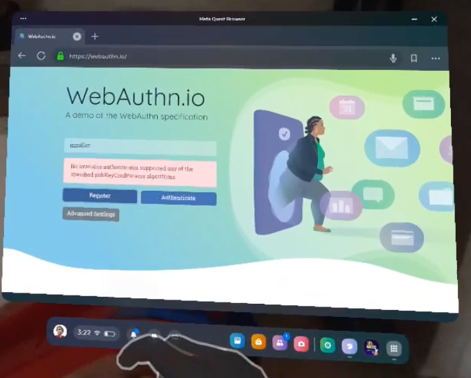
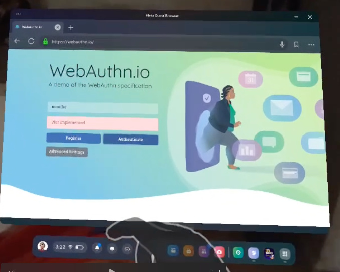
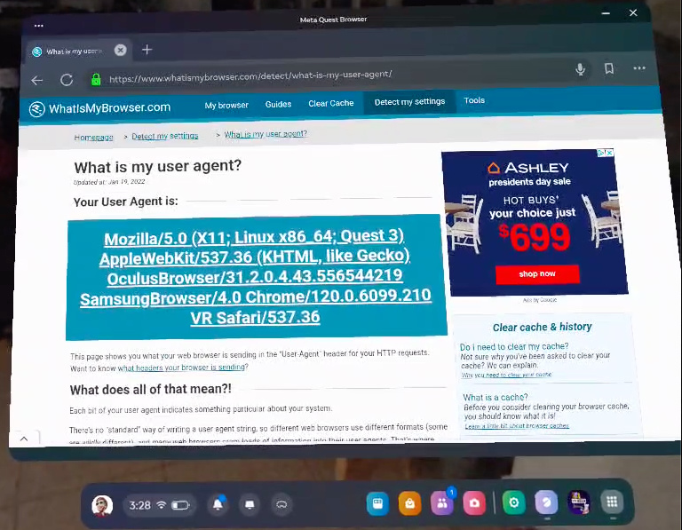

+++
title = "Passkeys support on the Meta Quest 3 build 60"
date = "2024-02-05T23:32:18.199Z"
description = "Taking a look at WebAuthn support in VR"
categories = ["passkeys", "webauthn", "gadgets"]
keywords = ["meta", "quest 3", "passkeys", "webauthn"]
hasCode = false
+++

I picked up a [Meta Quest 3](https://www.meta.com/quest/quest-3/) thanks to [Apple Vision Pro launch day hype](https://www.theverge.com/24059284/apple-vision-pro-launch-day-news), ostensibly to see what the latest and greatest in consumer VR looked like without dropping $3500 on a single gadget.

I'll note that I've been a long time owner of a VR setup: I purchased an HTC Vive shortly after its launch and eventually upgraded it to wireless and a pair of Valve's Index controllers. It's largely sat unused, though, because in my opinion after the phenomenal [Beat Saber](https://www.beatsaber.com) there's **still** not much in the way of a "killer app" in VR to keep me coming back...but I digress. The fact is that lots of incremental improvements have happened in the VR space since the Vive's launch, including better screen resolution, better lenses for increased field-of-view, and hand tracking to boot. If Apple is now betting big on the tech then surely the Quest 3 should be an adequate proxy for the AVP experience (and the Quest's upcoming [v62 update will even introduce support for Apple's Spatial Videos](https://www.meta.com/blog/quest/v62-software-update-spatial-video-playback-gamepad-support-browswer/) 👀)

What I want to capture here is how WebAuthn currently works on one of the most popular consumer VR appliances on the market. Has VR been keeping up with the latest in phishing-resistant authentication technologies vis-a-vis its support for WebAuthn/passkeys? Let's _take a look_ (see what I did there? 😏) via a [Meta Quest 3 running v60](https://communityforums.atmeta.com/t5/Announcements/Meta-Quest-build-v60-release-notes/ba-p/1111914).

NOTE: I apologize in advance for the blurry quality of the screenshots below. I couldn't figure out how to take screenshots of the Browser app itself from within the Quest 3, so I had to take screenshots of a screen recording instead. I've included quotes of the exact error message in each section.
{.note role="note"}

## `navigator.credentials.create()`

Unfortunately right off the bat we get a registration error. Trying to register an authenticator immediately raises a `NotSupportedError`:

The error message in the screenshot is the user-friendlier "**No available authenticator supported any of the specified pubKeyCredParams algorithms**" as webauthn.io interprets via my [@simplewebauthn/browser](https://github.com/MasterKale/SimpleWebAuthn/tree/master/packages/browser) library.

Trying to tweak attachment, discoverable credential, or any other setting yields the same result. And we can't really narrow down our list of public key credential algorithms because ES256 and RS256 are the only options webauthn.io sends as the most commonly supported algorithms.

## `navigator.credentials.get()`

Unsurprisingly authentication fails to work too:

This fails with a straightforward "**Not implemented**" error.

## Meta Quest 3 Browser User Agent

The **"Browser" app on the Meta Quest 3** has the following User Agent:

Naive user agent parsing might interpret this as Chrome on Linux, but the presence of `OculusBrowser` should be a dead giveaway that this is a Quest device. `VR Safari` is noteworthy to me because I don't think I've seen it from any other device (and Safari on VisionOS definitely doesn't mention this anywhere, see the **Addendum** below.)

Here's the entire **Meta Quest 3 Browser** user agent string:

> Mozilla/5.0 (X11; Linux x86_64; Quest 3) AppleWebKit/537.36 (KHTML, like Gecko) OculusBrowser/31.2.0.4.43.556544219 SamsungBrowser/4.0 Chrome/120.0.6099.210 VR Safari/537.36

This can come in handy in crafting passkey experiences that disable use of WebAuthn in this browser since it won't work anyway.

## Conclusion

The simple answer is **no**, the Meta Quest 3 does **not** support passkeys as of build 60.

## Addendum

Here's the user agent from an Apple Vision Pro running VisionOS 1.0.2 for comparison with the Quest 3's above:

> Mozilla/5.0 (iPad; CPU OS 16_3_1 like Mac OS X) AppleWebKit/605.1.15 (KHTML, like Gecko) Version/17.1.4 Mobile/15E148 Safari/604.1

No mention of `VR Safari` anywhere... 🤔
