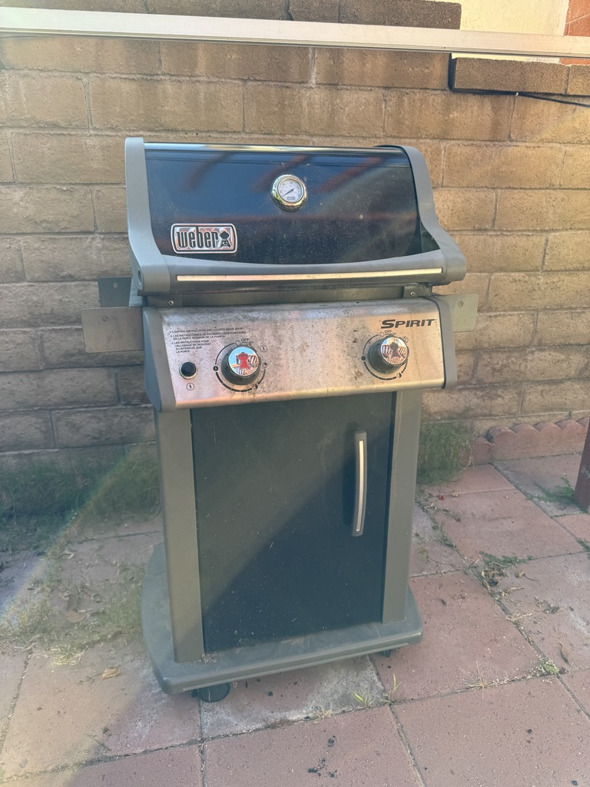
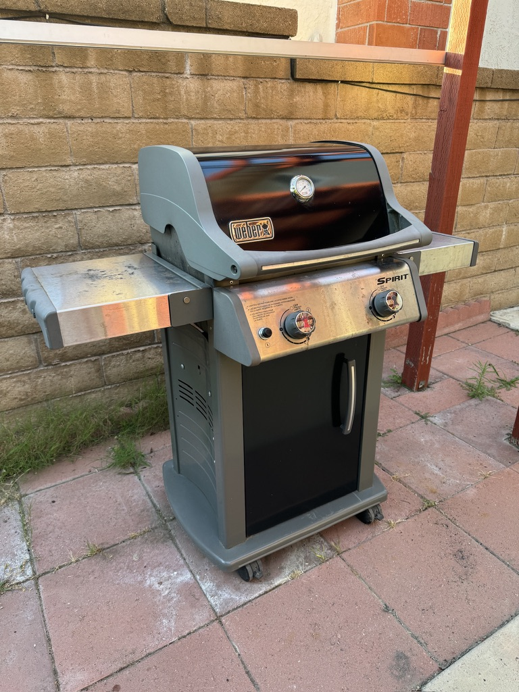
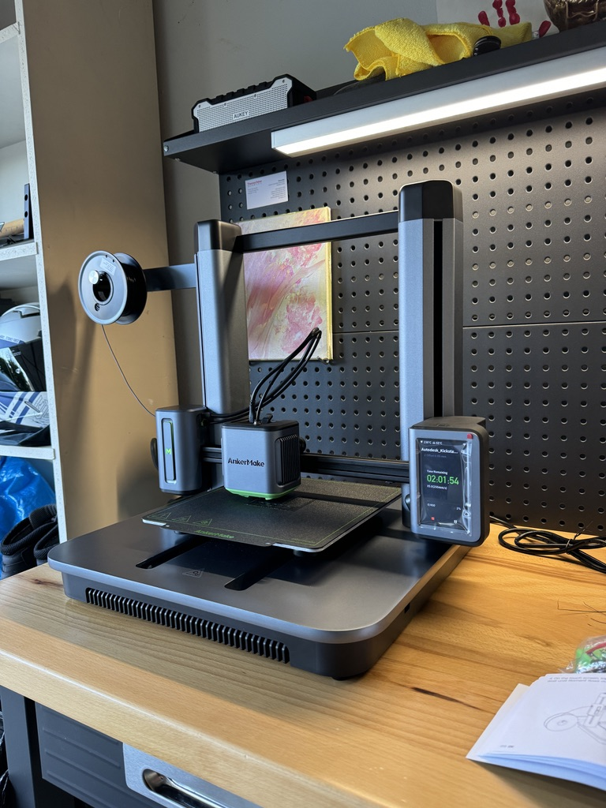

+++
title = "Now starts the barbecuing and 3D printing chapter of my life"
date = "2024-06-26T05:17:33.705Z"
description = "Breaking out of a funk with delicious food and command over the physical world."
categories = ["misc"]
keywords = ["barbecuing", "3d printing"]
hasCode = false
+++

## Back to barbecuing

It's been nearly 10 years since the last time I grilled anything at home thanks to pesky HOA rules at our last place. Now that I'm free from that tyranny, though, I'm determined to get my grilling groove back on.

Last weekend it was thanks to the tireless efforts of my lovely wife that I managed to snag a [Weber Spirit E-210](https://www.weber.com/US/en/gas/spirit/spirit-e-210-gas-grill/46110001.html) **for free** off of one of those "free stuff" Facebook groups! Normally $500 brand new, this one had clearly sat unused for a while and needed a bit of TLC. Two hours of scrubbing and scraping later (and $40 for a new burner), though, and it was good to go!

**Before:**

**After:**

Honestly I couldn't be happier. I've been wanting a Weber grill for *ages* but they basically never go on sale. To get one in relatively good condition for $0 was clearly me cashing in some karma.

Fortunately it's summer! It's the perfect time for some outdoor barbecuing, and plenty of opportunities to relearn the fundamentals. Starting with some black pepper beef kabobs and hotdogs... 🤤

## Revisiting 3D printing

In addition to brushing up on my grill skills, I've finally unpacked my kickstarted [AnkerMake M5](https://www.ankermake.com/m5). The last 3D printer I owned was a [PrintrBot Simple Metal](https://makezine.com/article/digital-fabrication/3d-printing-workshop/review-new-metal-printrbot-simple/) I purchased and put together around 2016. Compared to that the M5 is a thing of beauty:

After going three for three with prints with the M5 I can tell that 3D printing has come a *long* way since 2016:

1. PLA+ makes up for some of the weaknesses of PLA
2. ASA, PETG, and TPU are new materials to play around with
3. Slicing and modeling software are very streamlined
4. I can watch the printer whir away in the garage from the comfort of my desk thanks to a built-in camera
5. Printing is finally "turnkey" enough that I feel like I can focus more on the modeling and less on filament and bed temperatures, zeroing, bed leveling, and other such trial and error tweaking from back in my PrintrBot days

This printer finally makes me feel like I'm living in that future "print whatever you need" world that 3D printing had always promised.

Speaking of modeling, I've decided to start learning [AutoDesk Fusion](https://www.autodesk.com/products/fusion-360/overview) (née Fusion 360.) I picked up a highly-reviewed book for my birthday last year called, "[Mastering Fusion 360](https://www.cadclass.org/pages/book)"; a single chapter in and I'm already feeling the gears turning in my head. I'm excited to see what I can achieve with knowledge of both modeling and 3D printing so I'm no longer entirely reliant on whatever I can find on [Thingiverse](https://www.thingiverse.com) and scale in [a slicer](https://support.ankermake.com/s/article/The-AnkerMake-Slicer).

## A break from the status quo

Part of why I feel relieved to have these things back in my life is that lately I've felt little energy to build anything. In the past I'd energize myself by spinning up a new web app, or maybe attempting to publish another open-source library. But lately the idea of any of this has failed to inspire me.

I suspect 3D printing will prove an effective change of course because it bridge the gap between the digital and the physical. I can get my ideas out in modeling software and then get hands-on with the physical print afterwards.

And as for barbecuing, making delicious food remains one of the most hands-on things we do in our day-to-day to lives. Except now I get to augment it all with a well-timed clack-clack of tongs. What's not to love about that? 😌

(How long till I can 3D print some meat? 🤔)
