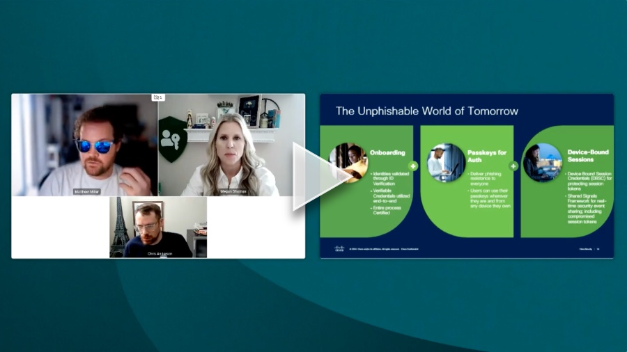

+++
title = "FIDO Passkeys Webinar: Achieving End-to-End Passwordless (webinar)"
date = "2024-08-30T14:28:06.466Z"
description = "Highlighting upcoming technologies that will help keep passwords out of more places."
categories = ["presentations"]
keywords = ["fido alliance", "passkeys"]
hasCode = false
+++

## Description

Authentication is a complicated problem with ever-creeping scope. Passkeys provide phishing-resistance at the point of authentication, but you need protection at enrollment and during the authenticated session thereafter, too, to truly fortify the authentication process against evolving threats.

In this discussion, authentication experts walk through all of the components of a user authentication workflow, highlighting areas of innovation and future steps for securing enrollment, authentication, and sessions.
