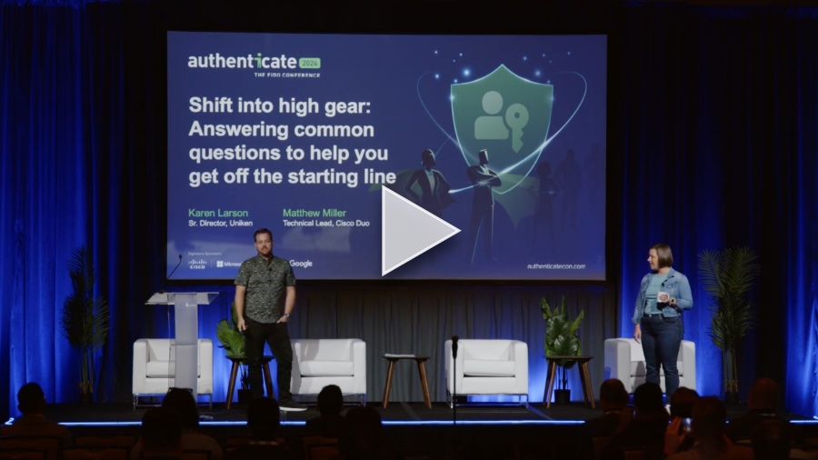

+++
title = "Shift into high gear: Answering common questions to help you get off the starting line @ Authenticate 2024"
date = "2024-10-14T13:00:00.000Z"
description = "Co-presenting with Karen Larson from Uniken on fundamental aspects of WebAuthn, including explanations of its myriad acronyms, what attestation is, and more!"
categories = ["presentations"]
keywords = ["fido alliance", "authenticate 2024", "passkeys"]
hasCode = false
+++

## Description

Have you wondered about where to start with implementing FIDO for your web sites and services? Maybe you’ve done some research but phrases like "MDS", "attestation", and "challenge" make things confusing. Let us help you lift the fog of confusion as we go through the top 5 questions about implementing FIDO2. We’ve scientifically pulled these questions as the most asked by looking at Stack Overflow, reading too many Reddit posts, and personal experience. At the end of this session you’ll have the tools and understanding you need to start the path to become an expert FIDO developer.

## Links

- Slides: [Authenticate 2024 - Shift Into High Gear.pdf](images/Authenticate%202024%20-%20Shift%20Into%20High%20Gear.pdf)
