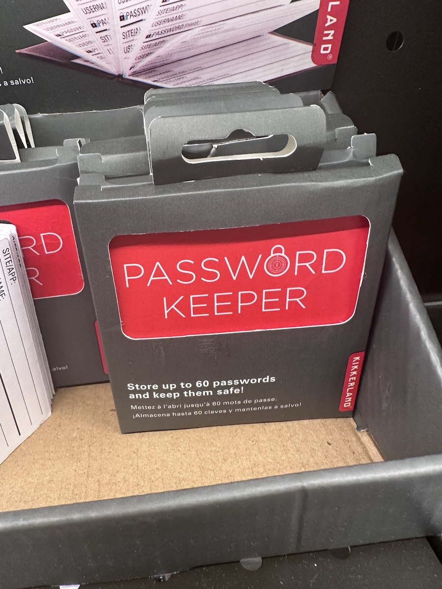

+++
title = "1Password vs 60Passwords"
date = "2025-10-20T17:42:57.213Z"
description = "A completely serious comparison (😉) of password manager solutions"
categories = ["satire"]
keywords = ["1password"]
hasCode = false
+++

How I saved $60/yr on my family password management:

I unironically think physical password books like these can be suitable solutions for people who aren't yet ready to embrace software credential managers. Most people don't have to factor "someone breaks into my house and steals my passwords" into their threat modeling, and a book like this encourages using unique passwords per website.

That said I strongly encourage everyone, including you, to adopt a software credential manager if you haven't already because it'll make it easier to manage your passkeys too ✌️
